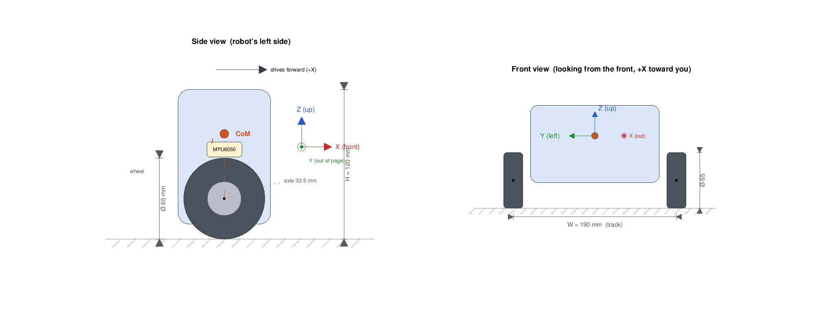

# Robot Mechanics (Chassis, Geometry & IMU Mounting)

The physical shape of the assembled robot: its wheel size, track width, height,
and where the IMU sits. These are not just build notes - every number here feeds
either the **inverted-pendulum model**
([../theory/inverted-pendulum.md](../theory/inverted-pendulum.md)) or the
**wheel/yaw kinematics** the controllers use. Measure them on *your* build and
keep this page (and [../../simulation/params.m](../../simulation/params.m)) in
sync with reality.

---

## 1. Key dimensions

| Quantity | Symbol | Value | Notes |
|----------|--------|-------|-------|
| Wheel diameter | $D$ | **65 mm** | -> radius $r = 32.5$ mm $= 0.0325$ m |
| Track (distance between the two wheels) | $W$ | **190 mm** | centre-to-centre of the wheel contact patches |
| Overall height | $H$ | **120 mm** | ground to top of the body |
| Axle height above ground | - | 32.5 mm | $= r$ (wheels sit under the axle) |
| Body height above the axle | - | ~87.5 mm | $H - r$; the "pendulum" part |

> "Distance between the two wheels" is taken **centre-to-centre** (the spacing of
> the two ground contact lines), because that is the $W$ used in the turning
> kinematics of §4. If you measured the inner or outer gap instead, correct to
> centre-to-centre before using it.

---

## 2. Layout

Two dimensioned views (drawn to scale), with the body-fixed IMU axes marked:



- **Side view** (robot's left side, front to the right): the height $H$, wheel
  diameter, axle height, and the CoM a distance $l$ up the body. The body-axis
  triad shows $X$ (front) and $Z$ (up); $Y$ points out of the page.
- **Front view** (looking from the front, $+X$ toward you): the track $W$ between
  the two wheels. Here the triad shows $Y$ (left) and $Z$ (up), with $X$ out of
  the page.

> The CoM height $l$ is drawn illustratively - it must be **measured** (§6). The
> figure is generated by
> [../../experiments/robot_mechanics/robot_mechanics_plot.m](../../experiments/robot_mechanics/robot_mechanics_plot.m).

---

## 3. Wheel geometry and odometry

The wheel radius converts between how fast the motor spins and how fast the robot
moves. With $r = 0.0325$ m and **1320 encoder counts per wheel revolution**
([gb37-520-dc-motor.md](gb37-520-dc-motor.md)):

| Quantity | Formula | Value |
|----------|---------|-------|
| Circumference | $C = \pi D = 2\pi r$ | 204.2 mm/rev |
| Distance per wheel revolution | $C$ | 204.2 mm |
| Distance per encoder count | $C / 1320$ | 0.155 mm/count |
| Linear speed from wheel rate | $v = r\,\omega$ | $\omega = 34$ rad/s $\to v \approx 1.10$ m/s |

So a wheel angular speed $\omega$ [rad/s] (what the inner
[wheel-speed controller](../theory/wheel-speed-controller.md) regulates) becomes a
ground speed $v = r\,\omega$, and encoder counts integrate into travelled
distance via $0.155$ mm each.

---

## 4. Track width and turning (differential drive)

With two independently driven wheels a distance $W$ apart, the body's forward
speed and turn (yaw) rate follow the standard differential-drive kinematics:

$$
v = \frac{v_R + v_L}{2} = \frac{r}{2}\,(\omega_R + \omega_L),
\qquad
\dot\psi = \frac{v_R - v_L}{W} = \frac{r}{W}\,(\omega_R - \omega_L)
$$

- **Common** wheel motion (both wheels the same) drives the robot **straight**.
- **Differential** wheel motion (wheels opposite) **turns** it. Spinning in
  place ($\omega_L = -\omega_R$) gives $\dot\psi = 2r\,\omega_R / W$.

This is exactly the split the (future) `mixer` uses -
`w_set_L = w_common + w_diff`, `w_set_R = w_common - w_diff`
([../theory/README.md](../theory/README.md)): `w_common` sets $v$, `w_diff` sets
$\dot\psi$. With $r = 0.0325$ m and $W = 0.190$ m, one unit of $w_{\text{diff}}$
(rad/s of wheel-speed difference) produces $\dot\psi = r/W \cdot 2\,w_{diff}
\approx 0.34\,w_{diff}$ rad/s of yaw.

---

## 5. IMU (MPU6050) mounting and axes

The MPU6050 is mounted so its sensor axes line up with the robot body as:

| Board axis | Points toward | Rotation about it | Robot meaning | Sensor channel |
|------------|---------------|-------------------|---------------|----------------|
| **X** | **front** | roll | (side-to-side lean, unused) | `ax`, `gx` |
| **Y** | **left** | **pitch** | **the balance tilt $\theta$** | `ax`+`az`, `gy` |
| **Z** | **up** | yaw | heading $\psi$ | `gz` |

$Z = X \times Y = \text{front} \times \text{left} = \textbf{up}$, so this is a
standard right-handed frame (the axes printed on the MPU6050 breakout).

```
   top view (Z = up, out of the page)

              +X  front
               ^
               |
      +Y  <----O      O = MPU6050
     left      |
               |
```

**Which signal is the balance signal.** The robot tips forward/backward by
rotating about the **Y (left) axis** - that is *pitch*, and it *is* the tilt
$\theta$ the balance loop controls. Therefore:

- **Tilt angle $\theta$** comes from the accelerometer's **X and Z** components,
  $\theta_{acc} = \operatorname{atan2}(-a_x, a_z)$ (gravity projected into the
  body - see [../theory/angle-estimation.md](../theory/angle-estimation.md)). The
  leading minus pins $+\theta$ = tipped forward (§7); see the sign note below.
- **Tilt rate $\dot\theta$** is the **gyro Y** channel (`gy`) directly.
- **Heading rate $\dot\psi$** is the **gyro Z** channel (`gz`), used later by the
  yaw loop.
- Roll (about X) is not used for a two-wheel balancer.

> **Signs are fixed in software, not hardware.** Whether "tipped forward" reads as
> $+\theta$ or $-\theta$, and which way `gy`/`gz` count, depends on the exact
> mounting flip, so the signs are pinned in the estimator rather than the wiring,
> matching the model conventions in
> [../../simulation/params.m](../../simulation/params.m).
>
> **Pinned (Phase 9).** With this mount, a forward tilt (rotation about $+Y$)
> projects gravity onto $-X$, so raw $\operatorname{atan2}(a_x, a_z)$ reads
> *negative* forward. The estimator therefore negates $a_x$:
> $\theta_{acc} = \operatorname{atan2}(-a_x, a_z)$, giving **$+\theta$ = tipped
> forward** so the balance loop's error $e = \theta - \theta_{ref}$ is positive on
> a forward lean ([../../firmware/main/balance_pid.c](../../firmware/main/balance_pid.c)).
> The tilt rate is $+g_y$ directly, which is exactly $\tfrac{d}{dt}\operatorname{atan2}(-a_x, a_z)$,
> so the accelerometer and gyro terms agree. Roll needs **no** minus (a rotation
> about $+X$ projects gravity onto $+Y$, so $\operatorname{atan2}(a_y, a_z)$ is
> already consistent with $+g_x$). The IMU driver still reads raw axes
> ([../../firmware/main/imu.c](../../firmware/main/imu.c)); the sign mapping lives
> in [../../firmware/main/estimator.c](../../firmware/main/estimator.c).

> **Mounting tips.** Keep the board flat and square to the body (a few degrees of
> mounting tilt shows up as a constant $\theta$ offset - removable by
> calibration, but easier to avoid). Mount it near the axle line and damp
> vibration (foam/standoffs) so motor buzz doesn't shake the accelerometer.

---

## 6. How these feed the pendulum model

The inverted-pendulum model ([../theory/inverted-pendulum.md](../theory/inverted-pendulum.md))
needs the wheel radius, the masses, the CoM height $l$ above the axle, and the
body inertia. The geometry here pins some of these directly and bounds others:

| Model parameter (`params.m`) | From this page | Value now in `params.m` | Notes |
|------------------------------|----------------|-------------------------|-------|
| `r_wheel` | wheel radius | **0.0325 m** (65 mm) | measured |
| `body_height` | body extent above axle | **0.0875 m** ($H - r$) | from 120 mm height, axle at 32.5 mm |
| `l` (CoM height above axle) | must be measured | **0.050 m** | ESTIMATE ($0 < l < 0.0875$) - measure (below) |
| `track` | wheel spacing | **0.190 m** | measured; for yaw kinematics (§4) |

> **Status:** `simulation/params.m` has been updated to these measured values
> (previously it seeded 67 mm wheels and a 300 mm body). Because this build is
> **shorter and lighter**, the body tips **faster**: the unstable pole rose from
> $+11.2$ to $\approx +20.6$ rad/s and the time-to-double dropped from
> $\approx 62$ ms to $\approx 34$ ms. That ripples through
> [../theory/inverted-pendulum.md](../theory/inverted-pendulum.md) and the balance
> timing budget in [../theory/loop-rates.md](../theory/loop-rates.md) (the balance
> loop must now cross above ~20.6 rad/s, forcing a tighter inner wheel loop).
> `m_wheel` and `m_body` are still unmeasured estimates - refine them next.

**Finding the CoM height $l$.** It is the single most important balance
parameter and cannot be read off a ruler. Two ways to get it:

1. **Balance test:** rest the powered-off body on a knife-edge / pencil under the
   axle line and find where it balances front-to-back; the CoM is directly above
   that point. Its height above the axle is $l$.
2. **Swing test:** let the body hang freely from the axle and time its small
   oscillation period $T$; then $l = g\,(T/2\pi)^2$ for a point-mass idealization
   (or use the physical-pendulum form with the measured inertia).

Geometrically $l$ must lie between the axle (0) and the top (~87.5 mm); a
battery mounted low pulls it toward ~40-60 mm. Measure it and record the value
back in `params.m`.

---

## 7. Convention summary

To keep hardware, model, and firmware consistent:

- **$+X$ / forward** - the direction the robot drives on a positive command; the
  MPU6050 X axis points this way.
- **$+Y$ / left**, **$+Z$ / up** - complete the right-handed frame.
- **$+\theta$** - body tipped **forward** (toward $+X$); $\theta = 0$ is upright.
  This is pitch, about the Y axis.
- **$+\dot\psi$** - yaw about $+Z$ (turn direction fixed in software).
- **$+$ wheel command / $+$ encoder counts** - forward, for both wheels (encoder
  signs already normalized in
  [../../firmware/main/encoders.c](../../firmware/main/encoders.c)).

These match the state vector `x = [pos; vel; theta; omega]` used throughout the
[simulation](../../simulation/README.md) and theory docs.
