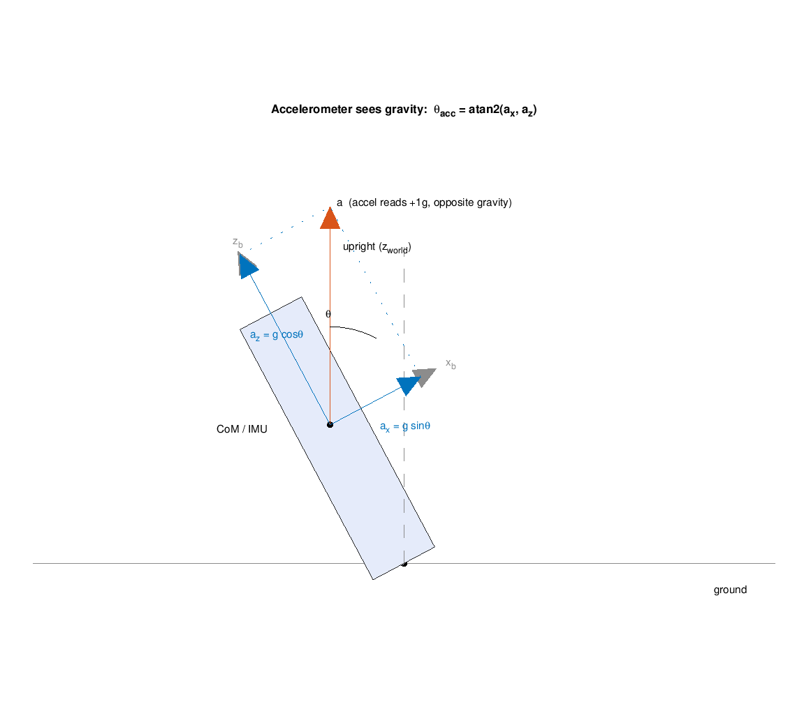
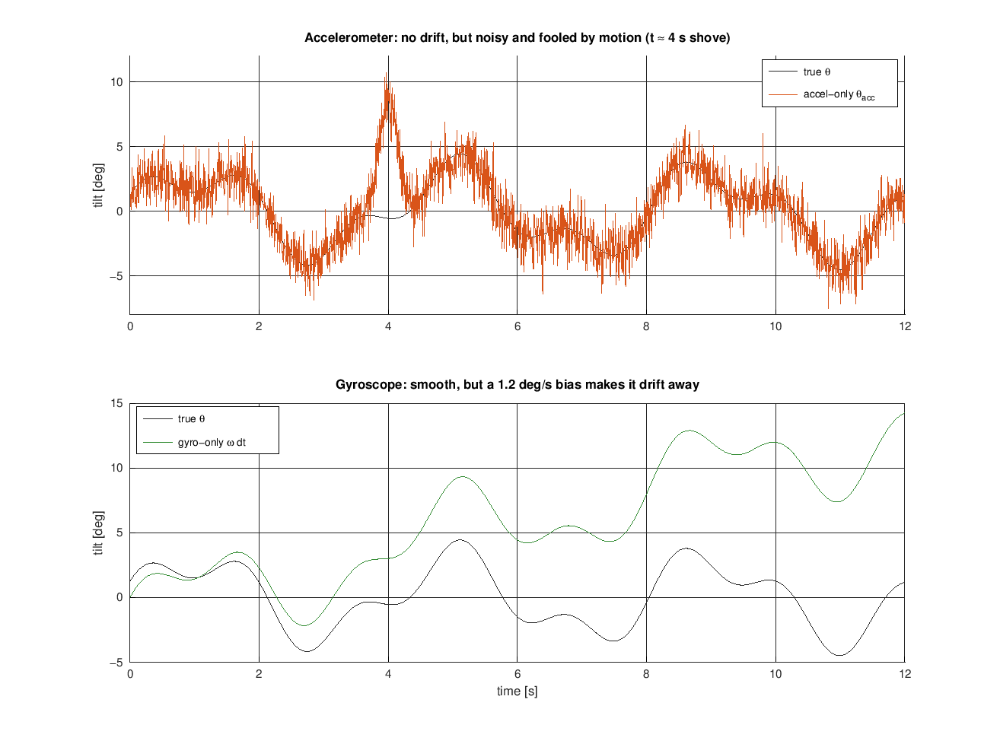
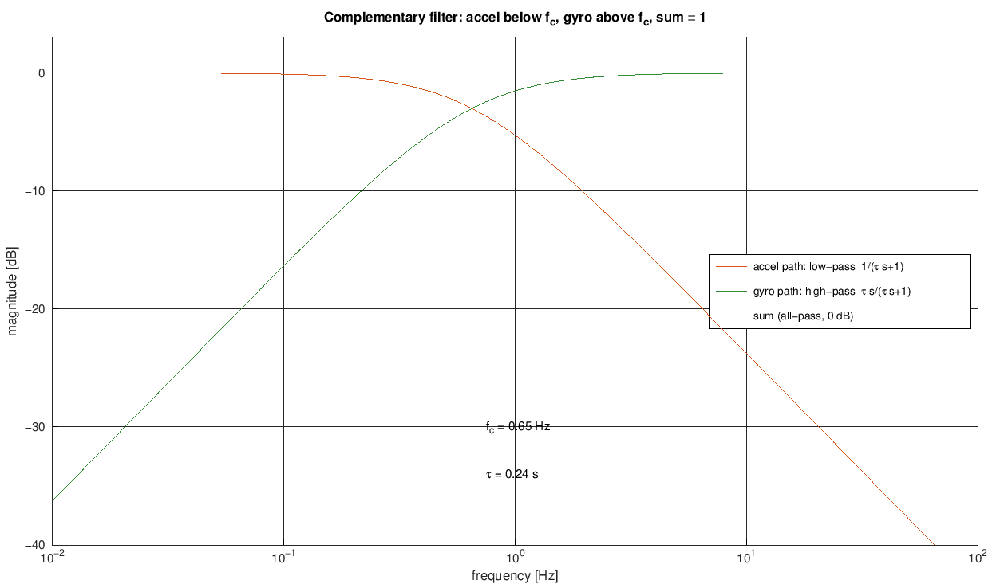
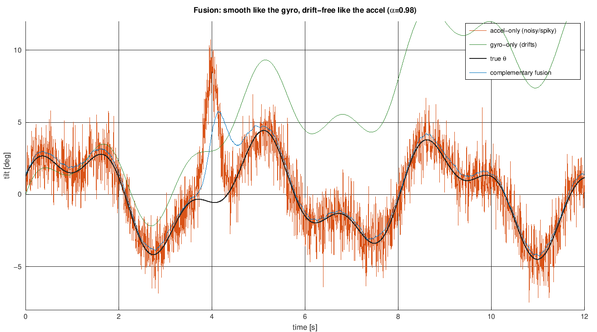
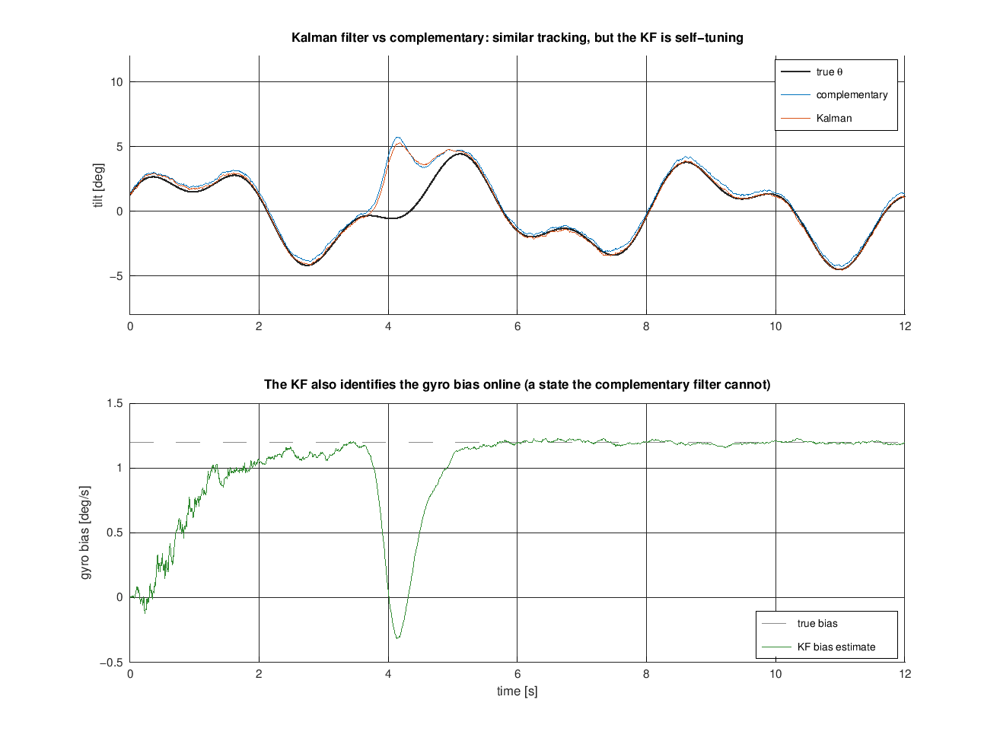

# Angle Estimation: Fusing the Accelerometer and Gyroscope

The balance controller needs to know **which way, and how fast, the body is
tipping** - the tilt angle $\theta$ (from upright) and its rate $\dot\theta$.
The MPU6050 ([../../firmware/main/imu.c](../../firmware/main/imu.c)) does **not**
measure either one cleanly: it gives a 3-axis *acceleration* and a 3-axis
*angular rate*, each useful but each flawed in its own way. This note explains,
at university level, why a single sensor is not enough and how fusing the two -
first with a **complementary filter**, then with a **Kalman filter** - produces a
tilt estimate that is smooth, drift-free, and fast enough to balance on.

> Math renders in GitHub and Cursor's Markdown preview (KaTeX). If you see raw
> `$...$`, use the preview. Figures are generated by
> [../../experiments/angle_estimation/angle_estimation_plots.m](../../experiments/angle_estimation/angle_estimation_plots.m)
> (base Octave). Rates come from [loop-rates.md](loop-rates.md); the discretization
> conventions are shared with [pi-discretization.md](pi-discretization.md).

## 1. What we need, and why it is hard

The robot is an inverted pendulum ([../../simulation/params.m](../../simulation/params.m)):
its state includes the body tilt $\theta$ (0 = upright) and tilt rate
$\dot\theta$. The balance loop feeds back both - roughly $u \propto K_\theta\,\theta
+ K_{\dot\theta}\,\dot\theta$ - so **an error in $\theta$ is an error in the thing
we are trying to drive to zero**.

Two properties make the estimate demanding:

- **It must be fast and low-lag.** The upright pole is unstable with a
  time-to-double of only $\approx 34$ ms ([loop-rates.md](loop-rates.md)). An
  estimator that lags the true angle by tens of milliseconds eats directly into
  the balance loop's phase margin.
- **It must be trustworthy during motion.** A balancing robot is *always*
  accelerating - that is how it stays up. The estimator cannot assume the robot
  is sitting still.

And yet neither raw signal is the angle. The gyro is a *rate*; the accelerometer
is a *force direction*. We have to build $\theta$ from them.

## 2. Two sensors, two opposite flaws

This is the whole idea in one table:

| | Accelerometer | Gyroscope |
|---|---|---|
| **Measures** | specific force (gravity + body acceleration), in g | angular rate $\omega$, in deg/s |
| **Gives us** | an *absolute* tilt via geometry, $\theta_{acc}$ | a tilt *rate*; integrate for angle |
| **Good at** | **long term** - no drift, always referenced to gravity | **short term** - smooth, immune to linear acceleration |
| **Bad at** | **short term** - noisy, and fooled by the robot's own motion | **long term** - a small bias integrates into unbounded drift |
| **Frequency** | trust at **low** frequency | trust at **high** frequency |

The last row is the punchline: their reliable bands are *complementary*. Fusion
is about using each sensor only where it is good.

## 3. Angle from the accelerometer (geometry)

At rest the accelerometer measures the **specific force**, which points exactly
opposite gravity - "up" at $1\,g$. Resolve that vector into the body's own axes
$(x_b, z_b)$ and the tilt falls out of the geometry:



$$
a_x = g\,\sin\theta,\qquad a_z = g\,\cos\theta
\quad\Longrightarrow\quad
\boxed{\;\theta_{acc} = \operatorname{atan2}(a_x,\, a_z)\;}
$$

`atan2` (rather than `asin`/`atan`) keeps the estimate correct through all four
quadrants and never divides by zero. Near upright the small-angle form
$\theta_{acc}\approx a_x/g$ is often enough.

> **Sign convention on this robot.** The formula above assumes a frame where a
> forward tilt makes $a_x$ *positive*. With the actual mounting (X front, Y left,
> Z up; [../hardware/robot-mechanics.md](../hardware/robot-mechanics.md)) a forward
> tilt projects gravity onto $-X$, so the firmware uses
> $\theta_{acc} = \operatorname{atan2}(-a_x, a_z)$ to keep **$+\theta$ = tipped
> forward**. That choice is what the balance controller expects (positive error on
> a forward lean) and it makes the accelerometer term agree with the $+g_y$ gyro
> prediction. Roll takes no minus. See
> [../../firmware/main/estimator.c](../../firmware/main/estimator.c).

**The fatal flaw.** An accelerometer does not measure gravity - it measures
gravity **plus the body's own linear acceleration**:

$$
\mathbf{a}_{meas} = \mathbf{g} + \mathbf{a}_{body}
$$

The instant the robot lurches to catch itself, $\mathbf{a}_{body}\neq 0$ and the
"down" direction it infers is wrong, so $\theta_{acc}$ reports a tilt that is not
there. On top of that, motor and road vibration add high-frequency noise. The
top panel below shows both effects - a noisy trace, with a large false spike
during a shove at $t\approx 4$ s:



So $\theta_{acc}$ is only trustworthy **on average / at low frequency**: it has
no drift (it is always tied to gravity), but its instantaneous value is
unreliable exactly when the robot is moving.

## 4. Angle from the gyroscope (integration)

The gyroscope measures the tilt rate directly, so integrating it gives an angle:

$$
\theta_{gyro}(t) = \theta_0 + \int_0^t \omega(\tau)\,d\tau
\qquad\longrightarrow\qquad
\theta[k] = \theta[k-1] + \omega[k]\,\Delta t
$$

Crucially, this is **immune to linear acceleration** - a gyro senses rotation, not
force - so it stays clean through exactly the maneuvers that corrupt the
accelerometer.

**The fatal flaw.** Any constant offset (bias) $b$ in the measured rate
integrates without bound:

$$
\int_0^t (\omega + b)\,d\tau = \theta_{true}(t) + \underbrace{b\,t}_{\text{drift}}
$$

A bias of just $1.2^\circ/\text{s}$ becomes $14^\circ$ of phantom tilt after
12 s - the runaway green trace in the figure above. Sensor noise integrates too,
into a slow random walk. So $\theta_{gyro}$ is excellent **short term** but
useless **long term**: its error lives at **low frequency** (drift is a slow
signal).

## 5. The key insight: fail in opposite bands, so combine by frequency

Line the two error profiles up:

- The **accelerometer** error is fast/noisy - it lives at **high** frequency; its
  low-frequency content (the average) is correct.
- The **gyroscope** error is drift - it lives at **low** frequency; its
  high-frequency content (the fast changes) is correct.

So the fusion rule writes itself: **low-pass the accelerometer angle, high-pass
the gyroscope angle, and add them.** Each sensor contributes only the band it is
good at.

## 6. The complementary filter

The cheapest realization is a single line, run once per control tick:

$$
\boxed{\;\theta[k] = \alpha\,\bigl(\theta[k-1] + \omega[k]\,\Delta t\bigr)
                     \;+\; (1-\alpha)\,\theta_{acc}[k]\;}
\qquad 0 < \alpha < 1
$$

Read it as "predict with the gyro, then nudge toward the accelerometer." It is
called *complementary* because the two weights are a low-pass / high-pass pair
that sum to one at **every** frequency. Writing the same filter in the frequency
domain (with $s$):

$$
\theta_{est} = \underbrace{\frac{1}{\tau s + 1}}_{\text{low-pass on }\theta_{acc}}\theta_{acc}
             \;+\; \underbrace{\frac{\tau s}{\tau s + 1}}_{\text{high-pass on }\theta_{gyro}}\theta_{gyro},
\qquad
\frac{1}{\tau s+1} + \frac{\tau s}{\tau s+1} = 1
$$

Because the two transfer functions add to unity, the fusion is **all-pass**: it
distorts neither gain nor phase of the true signal - it only routes each sensor
to its good band. That is the plot to internalize:



**The single knob $\alpha$** sets the crossover. Matching the difference equation
to the first-order filter gives

$$
\tau = \frac{\alpha\,\Delta t}{1-\alpha},
\qquad
f_c = \frac{1}{2\pi\tau}
$$

At $\Delta t = 5$ ms (200 Hz):

| $\alpha$ | $\tau$ | crossover $f_c$ | behavior |
|---------|--------|-----------------|----------|
| 0.90 | 45 ms | 3.5 Hz | fast accel correction, but lets motion noise in |
| 0.98 | 245 ms | 0.65 Hz | balanced (used in the figures) |
| 0.99 | 495 ms | 0.32 Hz | leans on the gyro |
| **0.995** | **1.0 s** | **0.16 Hz** | value used in [../../simulation/sim_discrete.m](../../simulation/sim_discrete.m) |

**Choosing $\alpha$** is a trade-off:

- **Higher $\alpha$** (crossover lower) trusts the gyro over a wider band, so the
  estimate is smoother and rejects motion contamination better - at the cost of
  correcting gyro drift more slowly.
- **Lower $\alpha$** corrects drift faster but lets accelerometer noise and
  motion errors leak in.

For a balancer the balance-loop dynamics live at a few Hz (crossover
$\approx 5\text{-}6.5$ Hz, see [loop-rates.md](loop-rates.md)), so a crossover
*well below* that ($f_c \sim 0.2\text{-}0.7$ Hz, i.e. $\alpha \approx
0.98\text{-}0.995$) is right: the **gyro** carries the fast, in-band tilt motion
(low lag, motion-immune), while the **accelerometer** only trims slow drift.

Run on the noisy data, the fused estimate is smooth like the gyro **and**
drift-free like the accelerometer, and it shrugs off the $t\approx 4$ s shove:



## 7. The Kalman filter (the principled version)

The complementary filter has one blind spot: it never *knows* the gyro bias, it
only outruns it. A **Kalman filter** treats the bias as an explicit state and
estimates it. The model is two states,

$$
\mathbf{x} = \begin{bmatrix}\theta \\ b\end{bmatrix},
\qquad
\begin{aligned}
\theta[k] &= \theta[k-1] + (\omega[k] - b[k-1])\,\Delta t \\
b[k]      &= b[k-1]
\end{aligned}
\qquad
\text{measure } \theta_{acc} = \theta + \text{noise}
$$

Each tick it **predicts** with the gyro (subtracting its current bias estimate),
then **corrects** toward the accelerometer by a gain $K$ that the filter computes
from the running error covariance and the two noise levels (gyro process noise
$Q$, accel measurement noise $R$). Where the complementary filter has a
fixed hand-tuned $\alpha$, the Kalman filter derives the optimal blend and, as a
bonus, **learns the gyro bias online**:



The bias estimate (bottom) climbs to the true $1.2^\circ/\text{s}$ and then
holds; the tracking (top) is comparable to the complementary filter. In fact a
**steady-state** 2-state Kalman filter reduces to *exactly* the complementary
filter structure - the complementary filter is a hand-tuned Kalman filter with the
bias state dropped. What the Kalman filter buys you:

- **Explicit bias estimation** - it removes drift at the source instead of
  outrunning it, so the accelerometer weight can be even lower (less noise).
- **Principled tuning** - you specify physical noise levels $(Q, R)$ rather than
  guessing $\alpha$.

The cost is more state, more compute, and two covariances to tune. For this robot
the complementary filter is usually enough to stand up; the Kalman filter is the
documented upgrade path (roadmap Phase 7, *Kalman filter for state estimation*).

## 8. Practical matters

- **Gyro bias calibration.** Before closing the loop, hold the robot still for a
  second and average the gyro - that mean *is* the bias $b$; subtract it. This is
  the roadmap's Phase 9 *calibrate the sensor* step. A complementary filter still
  needs this (it only handles the *residual* drift); a Kalman filter estimates
  the leftover online.
- **Gravity vs. acceleration cannot be fully separated** from a single 6-axis
  IMU. We manage it, not solve it: lean on the gyro in-band (high $\alpha$), and
  optionally *gate* the accelerometer update when $\lvert\mathbf{a}_{meas}\rvert$
  departs from $1\,g$ (a sign the reading is contaminated by motion).
- **Small angles and wrap-around.** Near upright, $\theta \approx a_x/g$ is fine;
  `atan2` handles larger tilts and sign changes without blowing up.
- **Discretization is the shared 200 Hz convention** of
  [pi-discretization.md](pi-discretization.md): the gyro integral is a
  forward-Euler sum, and the accelerometer blend is a backward-Euler (exponential)
  low-pass - the same $\alpha$ smoother used for the wheel-speed measurement.
- **What the controller actually consumes.** The balance loop takes $\theta_{est}$
  for its P/I terms and the **bias-corrected gyro rate directly** as $\dot\theta$
  for its D term - the gyro is already a clean rate, so there is no need to
  differentiate the (noisier) angle estimate. See the D term in
  [../../simulation/sim_discrete.m](../../simulation/sim_discrete.m).

## 9. Where this sits in the project

- **Firmware today.** The complementary filter runs on the ESP32 in
  [../../firmware/main/estimator.c](../../firmware/main/estimator.c) (fed raw
  accel/gyro from [../../firmware/main/imu.c](../../firmware/main/imu.c)); the
  `roll`/`pitch` fields in
  [../../firmware/main/telemetry.h](../../firmware/main/telemetry.h) are `NaN`
  until estimation is switched on, and $\alpha$ is runtime-tunable from the web
  UI. The pitch sign is pinned to $+\theta$ = forward (see §3), and a `gyrocal`
  command averages the gyro at rest to store its zero-rate bias.
- **The simulation** ([../../simulation/sim_discrete.m](../../simulation/sim_discrete.m))
  already runs the complementary filter with an honest sensor model and balances
  the robot with it - the practical proof that this estimate is good enough for
  the loop.
- **Next** (roadmap Phase 7): if drift or motion contamination proves limiting,
  upgrade to the 2-state Kalman filter that also tracks the gyro bias online.

## Reproduce

All five figures come from one base-Octave script:

```bash
cd experiments/angle_estimation
octave --eval angle_estimation_plots     # writes the five PNGs into docs/theory/
```

The complete complementary filter is the one line at the heart of §6:

```octave
theta = alpha*(theta + gyro*dt) + (1-alpha)*theta_acc;   % gyro predicts, accel corrects
```

and the Kalman filter is the standard predict/correct pair over the two-state
model in §7 (see the script for the covariance update).
