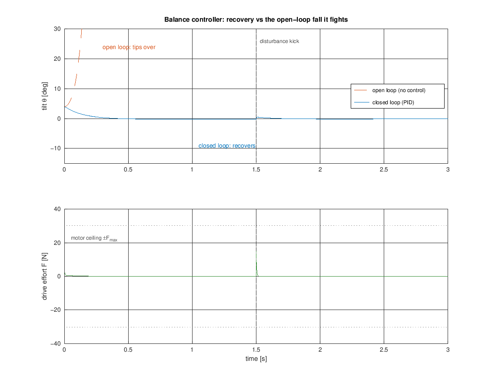
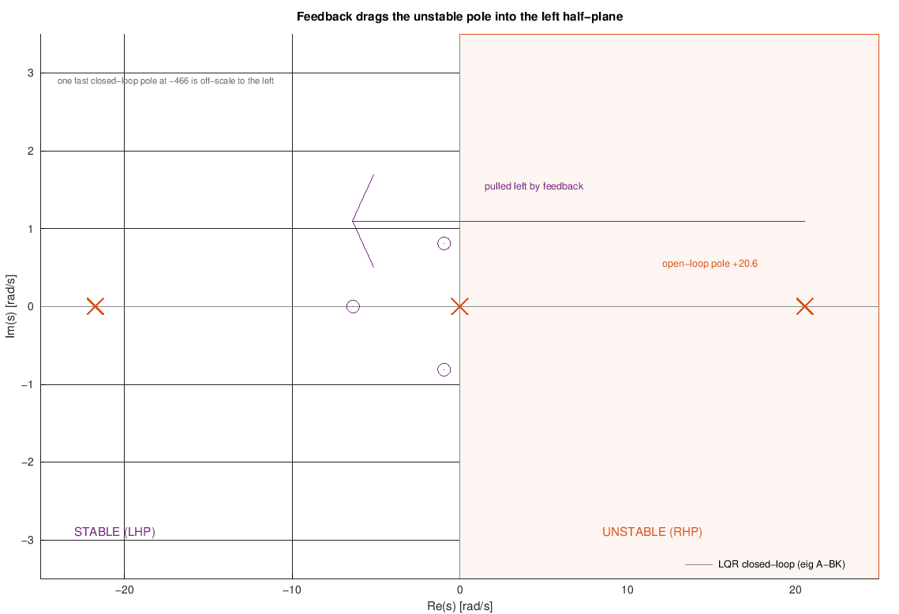
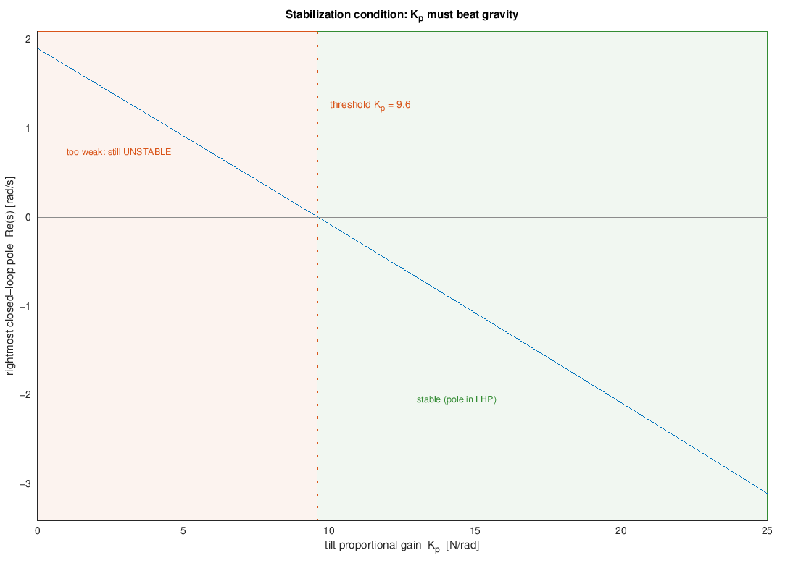
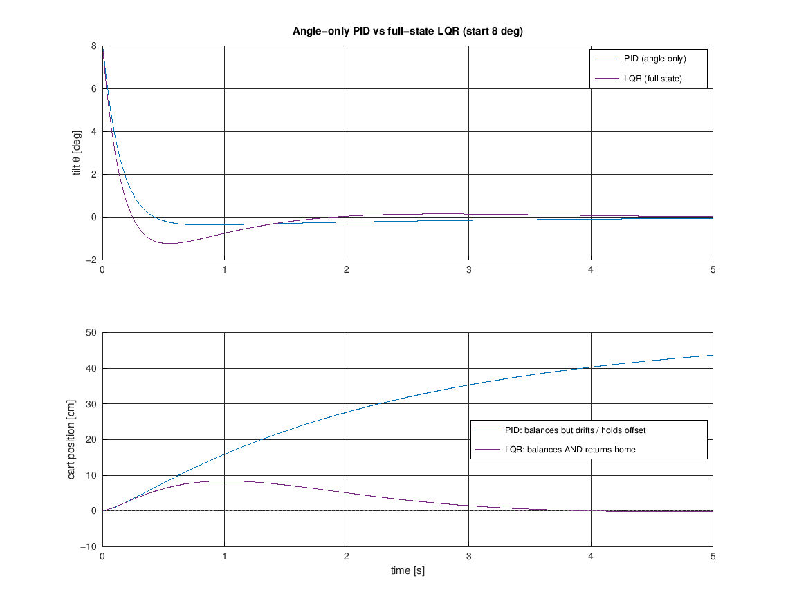

# Balance Controller: Keeping the Robot Upright

The balance controller is the heart of a self-balancing vehicle: it reads the
body tilt and drives the wheels so the robot stays standing. Left alone the
upright is **unstable** - the body falls with a time-to-double of only
$\approx 34$ ms ([inverted-pendulum.md](inverted-pendulum.md)) - so this loop
must actively push back many times a second. This note explains, at university
level, what the controller has to do, the simplest law that does it (a tilt
PID), *why* feedback can stabilize an unstable plant at all, why looking at tilt
alone lets the robot drift, and how full-state feedback (LQR) fixes that. It
stays light on firmware; the emphasis is the control theory.

> Math renders in GitHub and Cursor's Markdown preview (KaTeX). If you see raw
> `$...$`, use the preview. Figures are generated by
> [../../experiments/balance_controller/balance_controller_plots.m](../../experiments/balance_controller/balance_controller_plots.m)
> (base Octave), which reuses the sim's plant and design code
> ([../../simulation](../../simulation)) so the figures can't drift from the
> model. The plant it stabilizes is derived in
> [inverted-pendulum.md](inverted-pendulum.md); the $\theta,\dot\theta$ it feeds
> back come from [angle-estimation.md](angle-estimation.md); rates and
> discretization are in [loop-rates.md](loop-rates.md) and
> [pi-discretization.md](pi-discretization.md).

## 1. The job

The robot is an inverted pendulum on a driven cart
([../../simulation/params.m](../../simulation/params.m)). Its state is

$$
\mathbf{x} = \begin{bmatrix} x \\ \dot x \\ \theta \\ \dot\theta \end{bmatrix}
= \begin{bmatrix}\text{cart position} \\ \text{cart velocity} \\ \text{tilt from upright} \\ \text{tilt rate}\end{bmatrix},
$$

and linearizing about upright ([../../simulation/linearize.m](../../simulation/linearize.m))
gives $\dot{\mathbf{x}} = A\mathbf{x} + B\,u$ with open-loop poles

$$
\{\,0,\ -0.01,\ -21.7,\ \mathbf{+20.6}\,\}\ \text{rad/s}.
$$

The lone pole in the **right half-plane** ($+20.6$ rad/s) is gravity: any tiny
tilt grows exponentially. The balance controller's whole purpose is to move that
pole into the left half-plane with feedback. It has two jobs, in priority order:

1. **Stay up** - drive $\theta \to 0$ fast enough to beat the $34$ ms doubling.
2. **Stay put** - don't let the cart run away while balancing (§6).

## 2. Where it sits: the outer loop of the cascade

The balancer does not talk to the motors directly. It sits *on top of* the inner
wheel-speed loops ([wheel-speed-controller.md](wheel-speed-controller.md)):
it outputs a **common wheel-speed command** `w_common` [rad/s], the mixer sends
it to both wheels, and each inner PI loop makes the wheel actually turn at that
speed. This is the cascade from [README.md](README.md):

```text
  theta_ref = 0    e      +--------------+ w_common   +-------+ w_set   +-----------------+
   --------->(+)--------->|  C_theta(s)  |----------->| mixer |-------->| inner PI + body |--+
              ^ -         | balance_ctrl |            +-------+         |     = G(s)      |  |
              |           +--------------+                              +-----------------+  |
              |                                                                theta         |
              +--------------------------------- theta <------------------------------------+
```

- **Inputs:** the tilt estimate $\theta$ and rate $\dot\theta$ from the
  complementary/Kalman filter ([angle-estimation.md](angle-estimation.md)).
- **Output:** `w_common`, a wheel-speed setpoint - *not* a raw duty. The inner
  loop absorbs motor mismatch, deadband, and back-EMF, so the balancer sees two
  clean, identical wheels ([README.md](README.md)).
- **Timescale separation:** the inner loop must be faster than this one so
  the balancer can treat "commanded speed = actual speed." For this short,
  twitchy body that separation is *tight* - the balance crossover (~30 rad/s)
  sits just below the inner loop's ~40 rad/s closed-loop tracking. That headroom
  came from **removing the inner loop's redundant measurement low-pass**
  (`tau_f = 0`), not from a gain change; see the cascade discussion in
  [loop-rates.md](loop-rates.md).

> **A note on units.** The design and the simulation below reason in terms of a
> **cart force** $u = F$ (newtons) - the clean physical input to the pendulum.
> On the robot that force is produced by *accelerating the wheels*, so the
> implemented output is the wheel-speed command `w_common` that the inner loop
> realizes. The two are the same control idea in different units; the exact
> newton-to-firmware mapping lives in [../../simulation/MAPPING.md](../../simulation/MAPPING.md).

## 3. The one-line idea: drive the base under the centre of mass

Balancing a broomstick on your palm is the same problem: when the stick tips
right, you move your hand right, back under its centre of mass. The robot does
the same with its wheels. Formally, a positive (forward) tilt $\theta$ needs a
positive (forward) drive to catch it - and the linear model agrees: the control
column $B$ couples a positive force to a *negative* $\ddot\theta$, so pushing the
base forward rotates the body back upright.

Get the gain right and the robot recovers not just from an initial lean but from
outside shoves:



Open-loop (orange, dashed) the body tips over in a fraction of a second.
Closed-loop (blue) it pulls the $4^\circ$ starting lean back to zero and, when a
disturbance kick hits at $1.5$ s, rejects it with a brief burst of drive effort
(bottom) that stays well inside the motor ceiling $\pm F_{max}$.

## 4. The simplest law: a PID on tilt

Take the error $e = \theta_{ref} - \theta$ with $\theta_{ref} = 0$ and command

$$
u \;=\; -\big(K_p\,e + K_i\!\int e\,dt + K_d\,\dot e\big)
   \;=\; K_p\,\theta + K_i\!\int\theta\,dt + K_d\,\dot\theta .
$$

Each term has a physical job:

- **$K_p$ (proportional) - beats gravity.** The restoring drive must overcome the
  destabilizing gravity torque. If $K_p$ is too small the robot still falls, just
  slower (quantified in §5). This is the term that does the balancing.
- **$K_d$ (derivative) - adds damping.** Without it, $K_p$ alone overshoots and
  oscillates. Crucially, $\dot\theta$ is **the gyro reading directly** (a clean
  rate) - no need to differentiate the noisier angle estimate
  ([angle-estimation.md](angle-estimation.md)).
- **$K_i$ (integral) - removes steady offset.** A small CoM offset, a ramp, or a
  sensor bias would otherwise leave a persistent lean; the integrator trims it
  out.

The simulation ([../../simulation/sim_closedloop_pid.m](../../simulation/sim_closedloop_pid.m))
tunes $K_p = 45,\ K_i = 15,\ K_d = 5$ (force units) against the full nonlinear
plant - the gains behind the recovery in §3.

## 5. Why feedback can stabilize an unstable plant

Feedback doesn't just "resist" the fall - it **moves the poles**. Closing the
loop with a full-state gain $K$ (here from LQR, §6) replaces the open-loop $A$
with $A - BK$, and the eigenvalues that were partly in the right half-plane all
move left:



The unstable open-loop pole at $+20.6$ rad/s is pulled across the imaginary axis
into the stable region; every closed-loop pole now has a negative real part, so
every natural mode decays. That is the precise meaning of "the controller
balances it."

But there is a **minimum gain**. Reduce the tilt gain and at some point the pole
cannot be dragged past the axis - the robot stays unstable. For a
proportional-plus-derivative tilt law the condition is clean: the drive must
out-torque gravity, i.e. $K_p$ must exceed a threshold set by the plant:



Below $K_p \approx 9.6$ N/rad the rightmost pole sits in the right half-plane
(orange, still unstable); above it the pole crosses into the left half-plane
(green, stable). "$K_p$ must beat gravity" is not a slogan - it is this
axis-crossing. Above the threshold, more $K_p$ means a faster, deeper-stable pole
(and a stiffer response), traded off against control effort and noise.

## 6. Why tilt alone is not enough: full-state feedback

The tilt PID balances - but it is *blind to where the cart is*. The open-loop
pole at the origin (free cart position) is never moved by tilt-only feedback, so
the robot happily balances while **rolling away**. To also hold position we must
feed back all four states. The Linear-Quadratic Regulator (LQR) does this
optimally: it picks $u = -K\mathbf{x}$ (with $\mathbf{x} = [x,\dot x,\theta,\dot\theta]$)
to minimise

$$
J = \int_0^\infty \big(\mathbf{x}^\top Q\,\mathbf{x} + R\,u^2\big)\,dt,
$$

where $Q$ weights how much we care about each state error and $R$ penalizes
effort. With $Q = \mathrm{diag}(5,1,200,5)$ (tilt weighted most) and $R = 0.05$
([../../simulation/lqr_design.m](../../simulation/lqr_design.m)) the solver
([../../simulation/lqr_gain.m](../../simulation/lqr_gain.m)) returns

$$
K = \begin{bmatrix} -10.0 & -13.8 & -93.5 & -11.0 \end{bmatrix}
\quad\text{(force per unit of } x,\ \dot x,\ \theta,\ \dot\theta\text{)},
$$

with all closed-loop poles in the LHP ($\{-466,\ -6.4,\ -0.94\pm0.81i\}$). The
extra two gains on $x,\dot x$ are the whole difference - they gently lean the
robot to *drive back home* instead of drifting:



Both controllers keep the body upright (top), but the angle-only PID lets the
cart run off and hold an offset (~$44$ cm), while the LQR brings it back to the
start. Practically the tilt PID is enough to *stand*; position control is the
job of the outer `velocity_ctrl` loop (or, equivalently, the $x,\dot x$ terms of
an LQR).

## 7. Discretization and rate

On the robot this law runs as a difference equation at **250 Hz**, in lockstep
with the 250 Hz `imu_task` (the estimator fuses tilt at 250 Hz and the PID steps
every tick, `BALANCE_DIV = 1`):

- The integral $\int\theta\,dt$ becomes a running forward-Euler sum over the true
  4 ms step; the derivative term is the measured gyro rate (no numerical
  differentiation).
- 250 Hz is $\approx 76\times$ the unstable pole and gives ~8 corrections per
  34 ms doubling. Its sample-and-hold costs only $\approx 10^\circ$ at the ~30 rad/s
  crossover, well inside the margin the cascade sim shows at the recommended gains.
  It can be sub-rated back to 125 Hz (`BALANCE_DIV = 2`, $\approx 21^\circ$) if CPU
  gets tight - see [loop-rates.md](loop-rates.md).
- The continuous $\to$ discrete conventions (and integral anti-windup as a
  difference equation) are the shared ones in
  [pi-discretization.md](pi-discretization.md).

## 8. Practical matters

- **Output saturation + anti-windup.** The drive is clamped to what the motors
  can produce ($\pm F_{max}$, or the inner loop's duty limit). When saturated,
  stop integrating so the $K_i$ term cannot wind up and cause a huge overshoot on
  the way back - exactly the clamp in
  [../../simulation/sim_closedloop_pid.m](../../simulation/sim_closedloop_pid.m)
  and the pattern from [wheel-speed-controller.md](wheel-speed-controller.md).
- **Safety cut-off.** The linear model and the whole "catch it" strategy only
  hold near upright. Past a tilt limit (~$30$-$45^\circ$) the robot cannot
  recover; the firmware should **cut the motors** rather than command a doomed
  full-throttle lunge.
- **Startup.** Enable the loop only near upright, after the estimator has seeded
  ([../../firmware/main/estimator.c](../../firmware/main/estimator.c)); ramp in
  so it doesn't jerk.
- **It commands the inner loop, not the motors.** The balancer's output is a
  wheel-speed setpoint through the mixer; the inner PI turns that into duty. This
  keeps the two mismatched motors invisible to the balancer (§2).
- **Gains live in the sim, then map to firmware.** Tune $Q,R$ (or the PID gains)
  against the nonlinear plant, then convert units with
  [../../simulation/MAPPING.md](../../simulation/MAPPING.md). Because the body is
  short (small $l$), the balance dynamics are sensitive to the measured CoM
  height - see the note in [../../simulation/params.m](../../simulation/params.m).

## 9. Where this sits in the project

- **Firmware now implements this loop** as the `balance_pid` module
  ([../../firmware/main/balance_pid.c](../../firmware/main/balance_pid.c)): a tilt
  PID that outputs the common wheel-speed command `w_common` fed to both inner
  loops. It runs at 250 Hz under the `TEST_BALANCE` preset (`exp balance` /
  `balance on`), reading $\theta$ from the estimator and $\dot\theta$ straight
  from the gyro, with the fall cut-off of §8 (`BALANCE_MAX_TILT`) and the output
  clamped to $\pm$`BALANCE_W_MAX` = 20 rad/s. Gains are live-tunable
  (`bgains <kp> <ki> <kd>`), the upright trim with `btrim`.
- **The gains are simulation seeds.** The compiled defaults **`Kp = 45, Ki = 450,
  Kd = 3`** come from the multi-rate cascade sweep
  ([../../simulation/tune_cascade.m](../../simulation/tune_cascade.m), which ports
  the firmware inner loop with `tau_f = 0` + FF and runs balance at 250 Hz). In
  this **velocity** cascade the roles are *not* the textbook ones - the output is
  a wheel *speed*, whose derivative is the base acceleration:
  - **$K_i$ is the restoring stiffness.** It must clear $g/r \approx 302$
    (rad/s per rad) to out-torque gravity; 450 gives ~50% margin.
  - **$K_p$ is the damping** (it sets $\dot\theta$ feedback through the base).
  - **$K_d$ behaves like added base inertia - so keep it small.** Large $K_d$
    slows and under-damps the catch, the opposite of a force-PID.

  Because the fast `tau_f = 0` inner loop passes hot commands faithfully,
  over-large gains (especially $K_d$) chatter the duty and the resulting cart
  acceleration corrupts the tilt estimate (the accelerometer senses base accel as
  apparent tilt) - raise gently on hardware, and confirm the **sign** of $\theta$
  vs. drive direction first.
- **The simulation already balances** the robot end-to-end: the PID
  ([../../simulation/sim_closedloop_pid.m](../../simulation/sim_closedloop_pid.m)),
  the LQR ([../../simulation/lqr_design.m](../../simulation/lqr_design.m)), and
  the full discrete run with a sensor model
  ([../../simulation/sim_discrete.m](../../simulation/sim_discrete.m)) - the
  practical proof that this control law stands the robot up.
- **Next** (roadmap Phase 7): tune the gains on hardware, then add
  `velocity_ctrl`/`yaw_ctrl` for station-keeping and steering (the mixer already
  splits `w_common` / `w_diff`).

## Reproduce

All four figures come from one base-Octave script (reusing `simulation/`):

```bash
cd experiments/balance_controller
octave --eval balance_controller_plots     # writes the four PNGs into docs/theory/
```

The balance law itself is the one line at the heart of §4:

```octave
F = -(Kp*e + Ki*e_int + Kd*(-omega));   % e = theta_ref - theta;  D from the gyro
```

and the full-state version is a single dot product, `F = -K*x`, with `K` from the
Riccati solver in [../../simulation/lqr_gain.m](../../simulation/lqr_gain.m).
