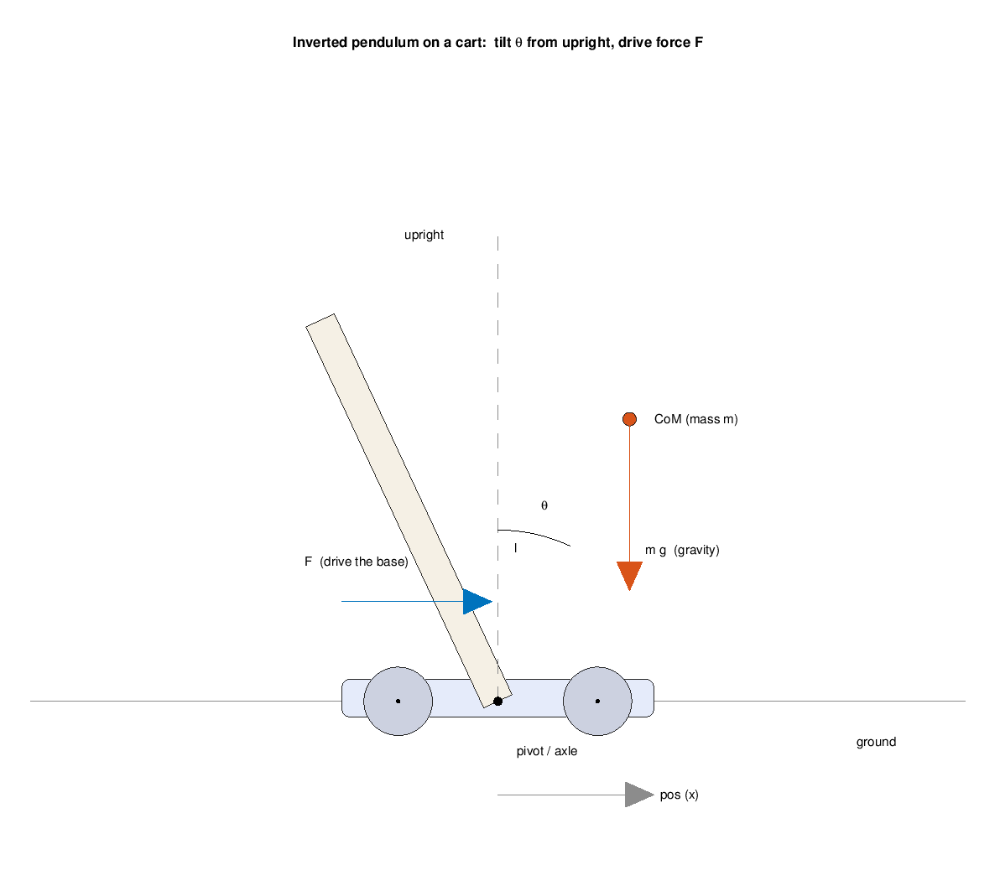
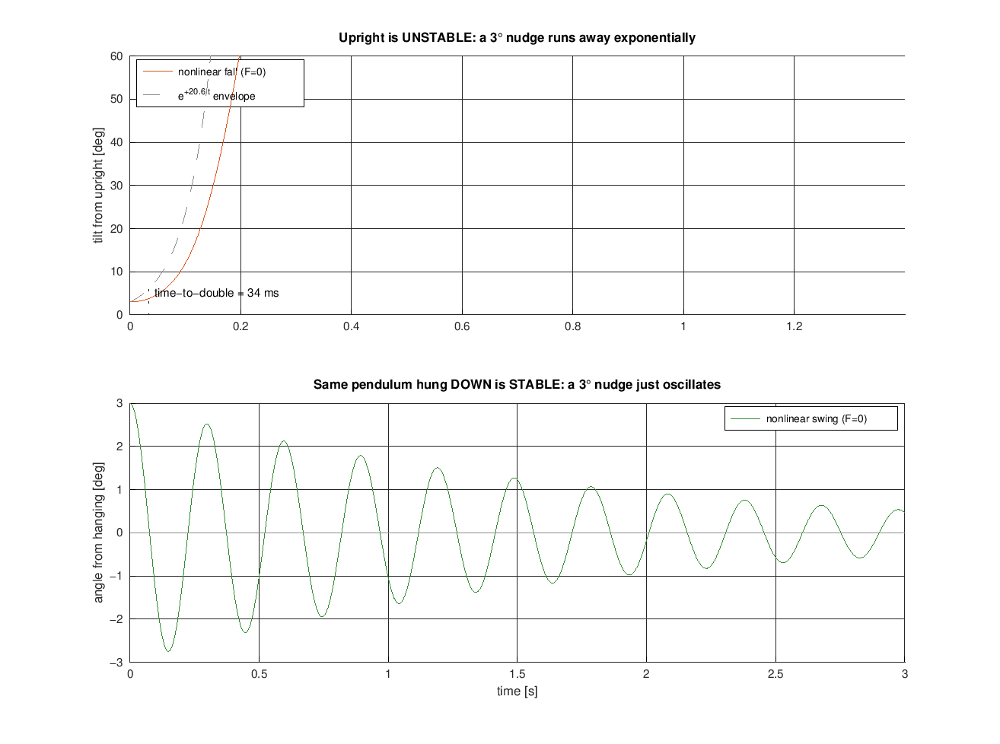
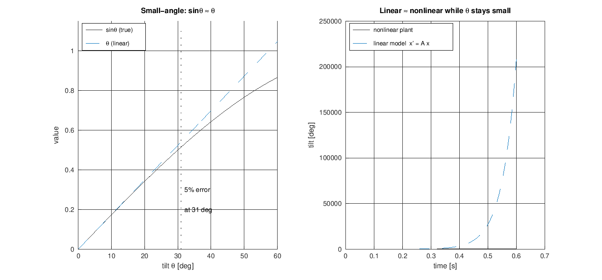
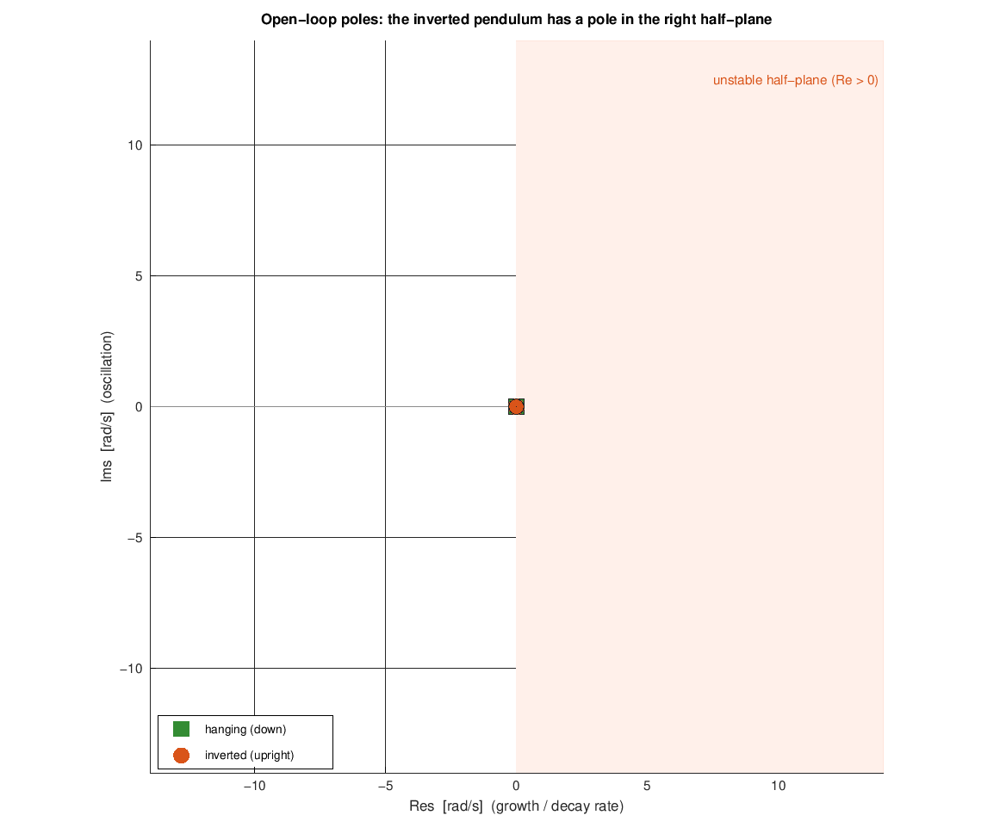
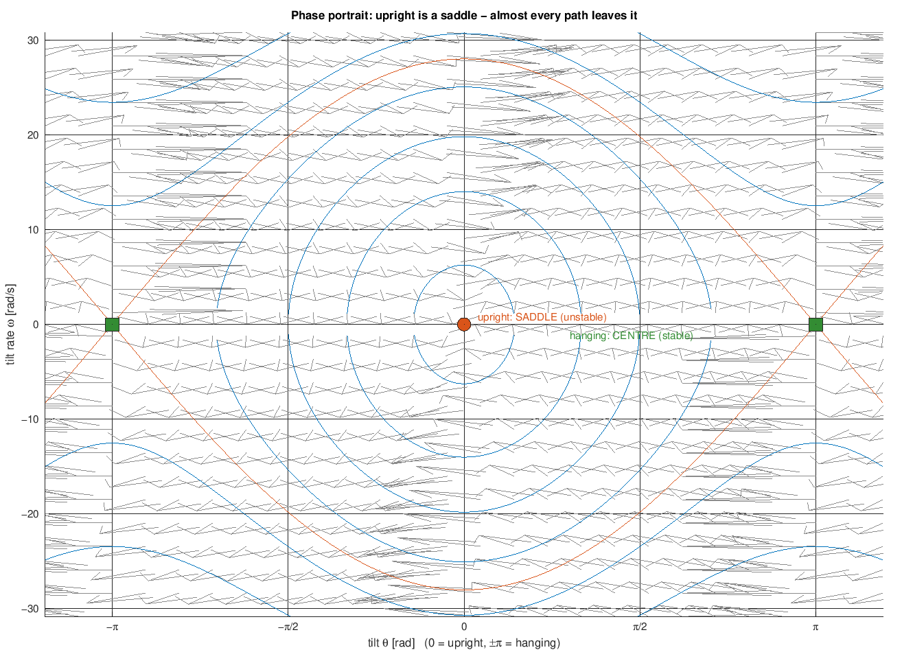

# The Inverted Pendulum: the Model Behind Balancing

Everything the robot does when it stands up is a fight against one piece of
physics: a body whose centre of mass sits **above** its pivot wants to fall.
That system - a mass balanced above a movable base - is the **inverted pendulum
on a cart**, the textbook model our whole control study rests on
([../../simulation/README.md](../../simulation/README.md)). This note explains,
at university level, *what the model is, where its equations come from, why the
upright is unstable, and why we can still balance it* - the theory you need
before any controller or code. It stays deliberately light on implementation;
the controllers that act on this model live in
[wheel-speed-controller.md](wheel-speed-controller.md) and the (upcoming)
balance-loop notes.

> Math renders in GitHub and Cursor's Markdown preview (KaTeX). If you see raw
> `$...$`, use the preview. Figures are generated by
> [../../experiments/inverted_pendulum/inverted_pendulum_plots.m](../../experiments/inverted_pendulum/inverted_pendulum_plots.m)
> (base Octave), which reuses the exact model in
> [../../simulation/](../../simulation/) - so the figures and the sim always
> agree. Numbers below come from [../../simulation/params.m](../../simulation/params.m)
> and [../../simulation/linearize.m](../../simulation/linearize.m).

## 1. The model: a cart carrying a pendulum

We split the robot into two rigid pieces:

- **The cart** - the wheels and axle. It can only *translate* along the ground.
  Its position is $x$ (called `pos` in the code) and we can push it with a
  horizontal force $F$ (produced by the motors).
- **The pendulum** - everything above the axle (frame, battery, ESP32, driver),
  treated as one rigid body of mass $m$ with its centre of mass (CoM) a distance
  $l$ up from the axle. It is free to *rotate* about the axle, tilting by an
  angle $\theta$ measured **from upright**.



By convention $\theta = 0$ is perfectly upright (the equilibrium we want to
hold), and $\theta > 0$ means the body has tipped forward, in the $+x$
direction. Two coordinates - $x$ for the cart, $\theta$ for the body - and their
rates fully describe the system. The whole state is

$$
\mathbf{x} = \begin{bmatrix} x \\ \dot x \\ \theta \\ \dot\theta \end{bmatrix}
= \begin{bmatrix}\text{position} \\ \text{velocity} \\ \text{tilt} \\ \text{tilt rate}\end{bmatrix}
$$

The single control input is the force $F$ on the cart. That is the crux of the
problem: **one input (drive the base), two things to manage (position *and*
tilt).** This is called an *underactuated* system, and it is what makes
balancing interesting.

## 2. Where the equations come from (energy)

The cleanest way to get the equations of motion is the **Lagrangian** method:
write the kinetic and potential energy, and let the calculus do the force
balancing. The CoM sits at

$$
\big(x + l\sin\theta,\; l\cos\theta\big),
$$

so differentiating gives its velocity, and the total kinetic energy is the cart,
the body's translation, and the body's rotation:

$$
T = \tfrac12 M\dot x^2
  + \tfrac12 m\big(\dot x^2 + 2l\dot x\dot\theta\cos\theta + l^2\dot\theta^2\big)
  + \tfrac12 I\dot\theta^2
$$

The potential energy is gravity acting on the CoM height:

$$
V = m g l \cos\theta
$$

That $\cos\theta$ is the whole story of instability in one term: potential energy
is **maximised** at $\theta = 0$ (upright). A ball balanced on top of a hill sits
at an energy maximum, and energy maxima are unstable - the tiniest nudge releases
it. (Contrast a normal pendulum, hanging down at $\theta = \pi$, which sits at an
energy *minimum* - a valley - and is stable.)

Feeding $T$ and $V$ through the Lagrange equations (done symbolically in
[../../simulation/eom_derive.m](../../simulation/eom_derive.m)) yields two coupled
equations, which we write in **manipulator form** $M(\theta)\,\ddot q = \text{rhs}$:

$$
\begin{bmatrix} M+m & m l\cos\theta \\ m l\cos\theta & I + m l^2 \end{bmatrix}
\begin{bmatrix} \ddot x \\ \ddot\theta \end{bmatrix}
=
\begin{bmatrix} F - b\dot x + m l\dot\theta^2\sin\theta \\ m g l\sin\theta - c\dot\theta \end{bmatrix}
$$

Read the two rows physically:

- **Top row (the cart):** force $F$, minus friction $b\dot x$, plus a reaction
  from the swinging body.
- **Bottom row (the body):** the **gravity torque $m g l\sin\theta$** - the term
  that tips it over - minus pivot damping $c\dot\theta$. The off-diagonal
  $m l\cos\theta$ is the **coupling**: accelerating the cart tilts the body, and
  a tilting body pushes the cart. That coupling is exactly the handle we use to
  balance - shove the base and the top responds.

Solving this $2\times2$ system for $\ddot x,\ddot\theta$ at every instant is the
nonlinear plant [../../simulation/plant_dynamics.m](../../simulation/plant_dynamics.m).
The parameters ($M, m, l, I, b, c$) all come from
[../../simulation/params.m](../../simulation/params.m).

## 3. Why the upright is unstable

Set the input to zero ($F = 0$) and let go from a small tilt. The gravity torque
$m g l\sin\theta$ has the **same sign as $\theta$**: tip forward a little and the
torque tips you *further* forward - a runaway. Integrating the true nonlinear
plant shows it plainly, and contrasts it with the same pendulum hung downward:



- **Upright (top):** a $3^\circ$ nudge grows *exponentially*, hugging the
  envelope $e^{+\lambda t}$ until the small-angle approximation breaks and it
  topples. There is no oscillation - it simply leaves.
- **Hanging (bottom):** the identical body hung *below* the axle ($\theta$ near
  $\pi$) has gravity fighting the motion, so the same nudge just **oscillates**
  and slowly decays. Stable.

Same hardware, opposite behaviour - the only difference is which side of the
pivot the mass sits on. That exponential growth rate $\lambda$ is the single most
important number for the whole design (§4).

## 4. The linear model about upright

Controllers are designed on a **linear** model, so we approximate the plant for
*small* tilts around upright. Using $\sin\theta \approx \theta$,
$\cos\theta \approx 1$, and dropping the $\dot\theta^2$ term (second order small),
the equations become linear and can be written as a state-space model

$$
\dot{\mathbf{x}} = A\,\mathbf{x} + B\,F .
$$

For the current parameters, [../../simulation/linearize.m](../../simulation/linearize.m)
computes

$$
A = \begin{bmatrix}
0 & 1 & 0 & 0\\
0 & -0.03 & -18.25 & 0.05\\
0 & 0 & 0 & 1\\
0 & 0.47 & 447.05 & -1.14
\end{bmatrix},
\qquad
B = \begin{bmatrix} 0\\ 2.92\\ 0\\ -46.50 \end{bmatrix}.
$$

**Is the linear model trustworthy?** Only near upright - but that is exactly
where a *working* balancer lives (it holds $\theta$ within a few degrees). The
left panel below shows the small-angle approximation $\sin\theta\approx\theta$ is
within 5 % out to $\sim 31^\circ$; the right panel shows the linear model tracks
the true nonlinear fall closely while the tilt is small, then diverges once the
robot is already falling over (a regime the controller never allows):



**The poles.** The eigenvalues of $A$ are the open-loop poles - the natural
growth/decay rates of the system:

$$
s \approx \{\,0,\;\; -0.01,\;\; -21.73,\;\; +20.57\,\}\ \text{rad/s}
$$

Plotted on the $s$-plane, and compared against the *hanging* version of the same
body, the danger is obvious:



- The **inverted** pendulum (orange) has a **real pole at $+20.57$ rad/s in the
  right half-plane**. A pole with positive real part means a mode that grows like
  $e^{+20.57\,t}$ - the tip-over. Its mirror at $-21.73$ is the stable
  counterpart; the pole at $0$ is the free cart position (nothing pins where it
  sits), and $-0.01$ is slow friction.
- The **hanging** pendulum (green) instead has its pair on the *imaginary axis* -
  purely oscillatory, marginally stable. No right-half-plane pole, nothing to
  stabilise.

That one right-half-plane pole is *the* problem statement of this project. Its
growth rate sets a hard clock:

$$
\text{time-to-double} = \frac{\ln 2}{\lambda} = \frac{\ln 2}{20.57}
\approx 34\ \text{ms} .
$$

A small tilt **doubles every 34 ms**. Every stage of the balance path - sense the
tilt, estimate it, compute a command, drive the motors - must complete many times
inside that window, which is precisely why the control loop runs at 200 Hz (5 ms
per tick, ~7 corrections per doubling). The full timing argument is in
[loop-rates.md](loop-rates.md); the tilt estimate it depends on is in
[angle-estimation.md](angle-estimation.md).

## 5. The geometric view: a saddle point

There is a beautiful way to *see* the instability without any numbers: the
**phase portrait**, the plane of tilt $\theta$ versus tilt rate $\dot\theta$.
Every possible motion of the (undriven) pendulum is a curve in this plane, and
its shape near each equilibrium tells you the stability:



- **Upright $(\theta=0)$ is a saddle point.** Trajectories approach along one
  special direction (the *stable manifold*) but leave along another (the
  *unstable manifold*). Balance a pencil perfectly and it stays; nudge it the
  slightest bit off that razor-thin incoming path and it swings away. Almost
  every trajectory eventually leaves - that is what "unstable" looks like
  geometrically.
- **Hanging $(\theta=\pm\pi)$ is a centre.** Trajectories circle it - the
  familiar back-and-forth swing of an ordinary pendulum.
- The bold orange curve is the **separatrix**: the boundary between "swings back"
  and "goes over the top". It passes exactly through the upright saddle.

The job of the balance controller is to *reshape* this portrait - to use the
force $F$ to turn that saddle into a stable point, so trajectories spiral **into**
upright instead of away from it.

## 6. Can it even be balanced? (controllability)

Before designing anything, one question must be answered: with only a horizontal
force on the cart, can we actually influence *all four* states - including the
tilt we care about? This is **controllability**, and it has a clean linear-algebra
test. Form the controllability matrix

$$
\mathcal{C} = \big[\,B \;\; AB \;\; A^2B \;\; A^3B\,\big]
$$

and check its rank. [../../simulation/linearize.m](../../simulation/linearize.m)
reports $\operatorname{rank}\mathcal C = 4$ of $4$ - **fully controllable**. The
coupling term $m l\cos\theta$ from §2 is why: pushing the base does reach the tilt
(and vice versa). So a feedback controller *can* place the poles wherever we like -
in particular, it can drag that $+20.57$ pole into the left half-plane and make
upright stable. The physics permits balancing; the rest is designing the loop.

## 7. The balancing intuition

Strip away the math and the strategy is one sentence: **drive the base back under
the falling mass.** If the body tips forward, accelerate the wheels forward so the
axle catches up to the CoM and rights it - the same thing you do with a broom on
your palm. Feeding the force back from the measured state,

$$
F = -\big(k_1 x + k_2\dot x + k_3\theta + k_4\dot\theta\big),
$$

closes the loop. The $\theta$ and $\dot\theta$ terms do the balancing (react to
tilt and how fast it is growing); the $x$ and $\dot x$ terms keep the robot from
driving off while it balances. Choosing those gains - by pole placement, LQR, or a
tuned PID - is the design problem, explored offline in
[../../simulation/](../../simulation/) (`sim_closedloop_pid.m`, `lqr_design.m`)
before it ever runs on hardware.

## 8. From this idealization to the real robot

The clean model above is the *balance* abstraction. A few gaps separate it from
the firmware, each handled in its own note:

- **Force vs. motors.** The model's input is a tidy force $F$; the robot has two
  DC motors taking a PWM duty, each with its own gain, lag, and deadband. The
  inner **wheel-speed loop** ([wheel-speed-controller.md](wheel-speed-controller.md))
  turns two mismatched motors into one clean, predictable actuator so the balance
  loop can pretend it commands a force. That is the **cascade** structure of
  [README.md](README.md).
- **We don't measure $\theta$ directly.** The IMU gives acceleration and angular
  rate, not tilt. Fusing them into a clean $\theta,\dot\theta$ is
  [angle-estimation.md](angle-estimation.md).
- **It runs on a clock.** The continuous $\dot{\mathbf x}=A\mathbf x+BF$ becomes a
  200 Hz sampled loop; why that rate, and how continuous designs survive
  discretization, are [loop-rates.md](loop-rates.md) and
  [pi-discretization.md](pi-discretization.md).
- **Two wheels, and yaw.** The planar model is one wheel; the real robot has two,
  adding steering/heading. The mixer and yaw loop ([README.md](README.md)) layer
  on top once balance works.

This note is the foundation the whole `theory/` folder builds on: it is the
*plant*. Everything else - estimating its state, discretizing the loop, and
wrapping controllers around it - assumes the picture above.

## Reproduce

All five figures come from one base-Octave script (it pulls the model straight
from `simulation/`, so they cannot drift from the sim):

```bash
cd experiments/inverted_pendulum
octave --eval inverted_pendulum_plots     # writes the five PNGs into docs/theory/
```

The open-loop poles, time-to-double, and controllability check come from the
simulation itself:

```bash
cd simulation
octave --eval "linearize"     # A, B, eigenvalues, RHP pole + time-to-double, rank(C)
octave --eval "eom_derive"    # symbolic Lagrangian EOM, cross-checked vs plant_dynamics.m
```
