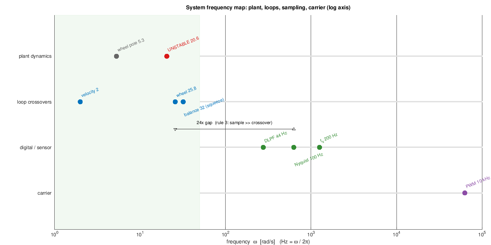
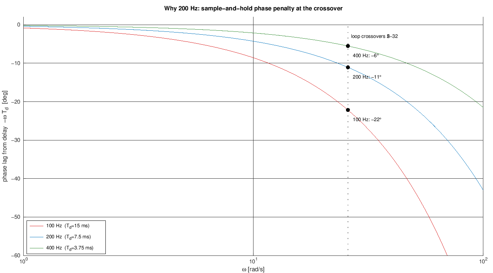
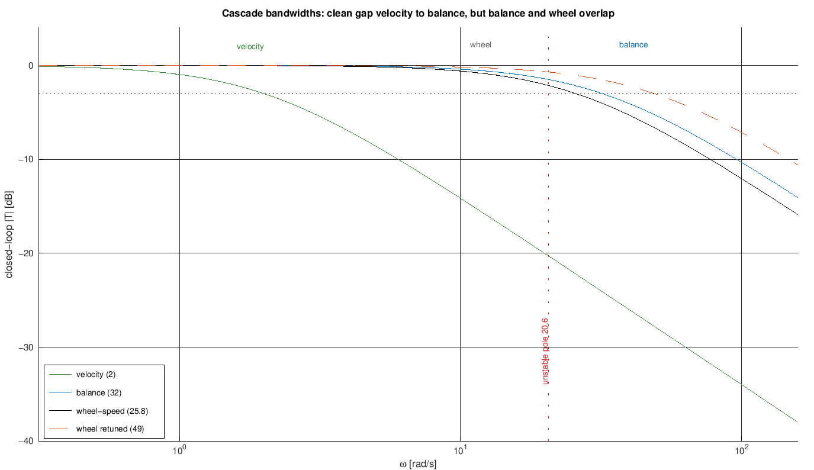
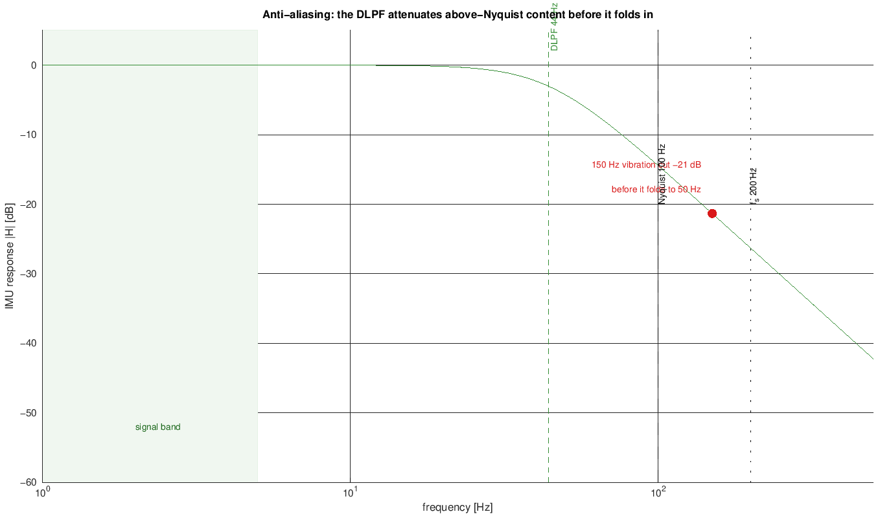

# Loop Rates and Sampling Frequencies

Every part of the robot runs on its own clock: the motor PWM switches at 10 kHz,
the control loop ticks at 200 Hz, the outer loops at 50 Hz, telemetry leaves at
2 Hz. This note explains, at university level, **why each of those numbers is what
it is** - from the physics that sets the fastest thing we must react to, up through
the sampling and anti-aliasing rules, to the actuator carrier. It is the timing
counterpart to the cascade in [README.md](README.md) and the loop-shaping in
[pi-tuning.md](pi-tuning.md).

> Math renders in GitHub and Cursor's Markdown preview (KaTeX). Figures are
> generated by
> [../../experiments/loop_rates/loop_rate_plots.m](../../experiments/loop_rates/loop_rate_plots.m)
> (base Octave).

## Three rules the whole design follows

1. **One master clock, integer sub-rates.** A single hardware timer ticks at
   `CONTROL_HZ` = 200 Hz
   ([../../firmware/main/telemetry.h](../../firmware/main/telemetry.h)); every
   slower activity (outer loops, telemetry) runs on an **integer division** of it.
   No second free-running loop, so there are no beat frequencies between
   asynchronous loops and every rate is a clean fraction of 200 Hz.
2. **Separation of timescales.** In a cascade each inner loop must look
   ~*instantaneous* to the loop wrapped around it, and each outer loop must look
   ~*quasi-static* (slowly varying) to the loop inside it. Rule of thumb: a factor
   of ~$3$-$5$ between successive loop **bandwidths** (crossover frequencies). Note
   this is about *bandwidth*, not sample rate - two loops can share the 200 Hz tick
   as long as their crossovers are separated.
3. **Sample fast, filter early.** Close a loop at $\omega_s \gtrsim 20\,\omega_c$
   (sample rate at least ~20x its crossover) so the sample-and-hold delay barely
   dents the phase margin and the discrete design behaves like the continuous one.
   Put every anti-alias / carrier frequency where it belongs: sensor bandwidth
   **below** the Nyquist of its read rate, PWM carrier **far above** the control
   rate.

## The whole stack on one axis

Because everything is a frequency, the entire design fits on **one logarithmic
axis**. This single picture is the doc in miniature; the rest just justifies each
marker.



Read it in four rows, slowest at the top:

- **Plant dynamics** (grey/red) - what physics hands us: the wheel pole and the
  *unstable* body pole. We do not choose these.
- **Loop crossovers** (blue) - the bandwidths we *design* our controllers to.
- **Digital / sensor** (green) - the rates we *pick*: the sensor bandwidth (DLPF),
  the control Nyquist, and the sample rate.
- **Carrier** (purple) - the PWM switching frequency.

Two gaps matter. The **green shaded band** (left, up to ~50 rad/s) is where all the
control action happens; everything to the right is "housekeeping" frequencies that
must stay clear of it. And the arrow marks the **~24x gap** between the fastest loop
(wheel, 25.8 rad/s) and the Nyquist frequency (628 rad/s) - that headroom is rule 3
in action.

## The plant timescales we must respect

The frequencies on the left of the map are not free choices - they are pinned by how
fast the physics moves. Two numbers dominate.

**The upright is unstable and fast.** From
[../../simulation/linearize.m](../../simulation/linearize.m) (numbers from the
current [../../simulation/params.m](../../simulation/params.m)) the open-loop
poles are

$$
s \approx \{\,0,\; -0.01,\; -21.73,\; +20.57\,\}\ \text{rad/s}
$$

The one in the right half-plane, $+20.57$ rad/s, is the body tipping over: a small
tilt grows like $e^{20.57\,t}$, i.e. **time-to-double $\approx 34$ ms**
($\approx 3.3$ Hz). Everything in the balance path - sense, estimate, compute,
actuate - has to happen many times inside that 34 ms or the robot falls. (This
robot is short - 120 mm - so its pole is fast; see
[../hardware/robot-mechanics.md](../hardware/robot-mechanics.md). A taller body
would tip more slowly.)

**The wheels are sluggish by comparison.** Each motor is first order with
$\tau \approx 0.19$ s ([motor-identification.md](motor-identification.md)), a pole
at $1/\tau \approx 5.3$ rad/s (0.84 Hz). The inner wheel-speed loop is tuned to a
crossover $\omega_c = 25.8$ rad/s (4.1 Hz) with $67^\circ$ phase margin
([pi-tuning.md](pi-tuning.md)).

The exact values (the numeric version of the map above):

| Frequency [rad/s] | [Hz] | What it is |
|-------------------|------|------------|
| ~1-3 | ~0.2-0.5 | outer velocity / position loop crossover (target) |
| 5.3 | 0.84 | open-loop wheel pole $1/\tau$ |
| 25.8 | 4.1 | inner wheel-speed loop crossover (tuned) |
| **20.57** | **3.27** | **unstable body pole** (time-to-double 34 ms) |
| ~30-40 | ~5-6.5 | balance loop crossover (must sit **above** the unstable pole) |
| 276 | 44 | IMU DLPF cutoff (sensor bandwidth) |
| 628 | 100 | control-loop **Nyquist** ($\omega_s/2$ at 200 Hz) |
| 1257 | 200 | control sample rate $\omega_s$ |
| ~6.3e4 | 1e4 | motor PWM carrier |

## The control tick: why 200 Hz

`CONTROL_HZ = 200` is the master rate; the whole real-time path (read IMU ->
estimate tilt -> run the loops -> write PWM) executes once per 5 ms tick
([../../firmware/main/control.c](../../firmware/main/control.c)).

**It is fast enough for the unstable pole.** Over one tick the tilt grows by
$e^{20.57\cdot 0.005} = e^{0.103} \approx 1.11$ - about 11% per tick, so the loop
gets ~7 correction opportunities per doubling time. `sim_discrete.m` balances the
robot at exactly this rate with an honest sensor + motor model, which is the
practical proof. (With the short body the margin is tighter than a taller robot's;
if bring-up struggles, 400 Hz is the first lever - see below.)

**The sampling delay is affordable.** Sampling is not free: holding the output flat
between ticks (zero-order hold) plus one tick of compute latency acts like a pure
**transport delay** of about $T_d \approx 1.5\,\Delta t = 7.5$ ms at 200 Hz, whose
phase lag $-\omega\,T_d$ grows linearly with frequency. That lag is exactly what
eats phase margin, so the sample rate is really a *phase-budget* decision:



At the crossover the loops actually run (~25 rad/s) the penalty is small at 200 Hz
($-11^\circ$) but doubles at 100 Hz ($-22^\circ$) and halves at 400 Hz ($-6^\circ$):

| Rate | $T_d$ | phase lag at 25.8 rad/s |
|------|-------|--------------------------|
| 100 Hz | 15 ms | $-22^\circ$ |
| **200 Hz** | **7.5 ms** | **$-11^\circ$** |
| 400 Hz | 3.75 ms | $-6^\circ$ |

The $-11^\circ$ at 200 Hz is small change against a ~$45$-$70^\circ$ phase-margin
budget - the same $-11^\circ$ term appears in the [pi-tuning.md](pi-tuning.md)
Nyquist analysis, which still lands $67^\circ$.

**Why not slower, why not faster.** The plot shows the sweet spot:

- **Slower (100 Hz)** costs $-22^\circ$ at the crossover, and with the unstable pole
  so close to that crossover the balance margin gets thin. 100 Hz is the floor.
- **Faster (400 Hz)** buys back ~$+5^\circ$, *but* it worsens **encoder velocity
  quantization**: one count in a tick is $\tfrac{2\pi}{1320}/\Delta t$ rad/s, which
  is $0.95$ rad/s at 200 Hz and doubles to ~1.9 rad/s at 400 Hz. Coarser speed
  needs heavier filtering, and the filter's own phase lag gives back much of what
  the shorter delay won.

So **200 Hz is the baseline** (delay small, quantization tolerable, sim-validated).
If bring-up shows the cascade is too tight (next section), **400 Hz is the first
knob to turn** - a one-line change, and the rest of the ladder scales with it.

## Cascade rates and the tight-separation caveat

The intended stack, inner to outer ([README.md](README.md)):

| Loop | Runs at | Divisor of tick | Crossover target | Separation check |
|------|---------|-----------------|------------------|------------------|
| `wheel_speed_ctrl` (inner) | 200 Hz | ÷1 | 25.8 rad/s (retune to ~49) | should be fastest closed loop |
| `balance_ctrl` | 200 Hz | ÷1 | ~30-40 rad/s | **> unstable pole 20.6** |
| `yaw_ctrl` | 50 Hz | ÷4 | ~2-5 rad/s | decoupled (differential) |
| `velocity_ctrl` | 50 Hz | ÷4 | ~1-3 rad/s | below balance |

Plotting each loop's closed-loop bandwidth (rule 2) shows the design tension at a
glance:



The velocity loop (green) sits a full decade below the others - a clean, textbook
separation. But **balance (blue) and wheel-speed (black) now clash**: the balance
loop must cross over *above* the unstable pole (red dotted, 20.6 rad/s) to
stabilize it, which pushes it to ~30-40 rad/s - **above** the untuned inner wheel
loop (25.8 rad/s). That inverts the cascade requirement (the inner loop must be
the *faster* one), so with this short body retuning the inner loop is no longer
optional. This is inherent to a small, twitchy balancer (short body -> fast
unstable pole), and it drives two choices:

1. **Push the inner loop tighter (now mandatory).** Retune the wheel-speed loop to
   $\tau_{cl}=\tau/10$, moving its crossover to $\omega_c \approx 49$ rad/s (orange
   dashed in the plot; the ideal $1/\tau_{cl}=53$, pulled down by the delay +
   measurement filter). Phase margin drops to ~$48^\circ$ at 200 Hz (still healthy);
   this puts the inner loop back above a ~32 rad/s balance loop (~1.5x separation).
   The margin is thin, so **400 Hz** is attractive here: the same crossover keeps
   ~$58^\circ$ and buys back separation headroom - the concrete payoff of the
   higher rate for this build.
2. **Sub-rate only the genuinely slow loops.** Velocity and yaw crossovers are
   ~1-5 rad/s, so 50 Hz (÷4) is >60x their bandwidth - plenty by rule 3 - while the
   ÷4 keeps them comfortably below the balance loop (rule 2) and saves CPU. Balance
   stays on the full 200 Hz tick because it lives right next to the unstable pole
   and cannot be slowed.

Firmware realization: the 200 Hz control task runs the inner + balance loops every
tick and the outer loops on a `tick % 4 == 0` sub-schedule (one code path, one
timer).

## Sensor rates and anti-aliasing

A sampled sensor has a trap: any signal above the Nyquist frequency (half the read
rate) does not just disappear - it **folds back** ("aliases") into the signal band
and masquerades as a low-frequency wobble the controller will chase. The cure is an
analog/early filter that attenuates high frequencies *before* they are sampled. The
MPU6050 ([../../firmware/main/imu.c](../../firmware/main/imu.c)) does this:



- **Internal sample rate 1 kHz** (`SMPLRT_DIV = 0`) - it oversamples, then we
  decimate by reading once per 200 Hz tick.
- **Digital low-pass ~44 Hz** (`CONFIG = 0x03`, ~44 Hz accel / ~42 Hz gyro). This
  is the anti-alias filter for our 200 Hz read: 44 Hz sits below the 100 Hz Nyquist
  with ~2.3x margin, and well above the ~5 Hz band the balance loop actually uses
  (green band), so the signal passes with negligible phase lag
  ($\arctan(5/42)\approx 7^\circ$ at 5 Hz) while structural vibration above ~100 Hz
  is knocked down before it can fold in - e.g. a 150 Hz vibration is cut ~21 dB
  before it would alias to 50 Hz.
- If hardware shows high-frequency vibration leaking in, drop the DLPF to ~21 Hz
  (`CONFIG = 0x04`) - still >4x the signal band. Do **not** raise it near 100 Hz.

**I2C bus 400 kHz** (`I2C_FREQ_HZ`): the 14-byte accel/temp/gyro block plus
addressing is ~20 bytes x 9 bits / 400 kHz $\approx 0.45$ ms, a ~9% slice of the
5 ms budget - fast enough to read every tick, which is why the estimator and
control share the 200 Hz rate instead of splitting.

## Actuator carrier: PWM at 10 kHz

Motor PWM runs at 10 kHz ([../../firmware/main/motors.c](../../firmware/main/motors.c),
`MOTOR_PWM_FREQ_HZ`), the XY-160D driver's ceiling - the lone marker far to the
right of the map. Placement:

- **Far above the mechanics.** The wheel bandwidth is ~5 rad/s (0.84 Hz); at 10 kHz
  the motor sees a smooth average voltage (duty), not a switching square wave - the
  winding inductance filters the ripple current.
- **50x the control rate.** Each 5 ms tick spans 50 PWM periods, so the commanded
  duty is effectively a continuous actuator to the loop.
- **At the top of the audible edge.** 10 kHz can whine; the code comment notes to
  lower it if it whines or heats. It must stay well above the control rate, so
  don't drop it below a few kHz.

## Telemetry and reporting

Logging is deliberately decoupled from control. The loop writes **one sample per
tick (full 200 Hz)** into a double buffer; a batch of `SAMPLES_PER_BATCH =
CONTROL_HZ/2 = 100` samples (0.5 s) is handed to the reporter, which emits **~2
frames per second** ([../../firmware/main/control.c](../../firmware/main/control.c),
[../../firmware/main/telemetry.h](../../firmware/main/telemetry.h)). So we transmit
at a network-friendly 2 Hz but never lose resolution - each frame carries the full
200 Hz history. The per-tick period is checked against $\pm40\%$ limits
(`DT_MAX/MIN_WARN_US`) so timing jitter surfaces as a warning instead of silently
corrupting the loop.

## Summary: every rate and where it lives

| Rate | Value | ÷ of tick | Set in | Rationale |
|------|-------|-----------|--------|-----------|
| Motor PWM carrier | 10 kHz | x50 | `motors.c` `MOTOR_PWM_FREQ_HZ` | above mechanics + audible edge, ≤ driver ceiling |
| IMU internal ODR | 1 kHz | x5 | `imu.c` `SMPLRT_DIV=0` | oversample before decimation |
| I2C bus clock | 400 kHz | - | `imu.c` `I2C_FREQ_HZ` | read IMU block in ~0.45 ms ≪ tick |
| Control master tick | 200 Hz | x1 | `telemetry.h` `CONTROL_HZ` | ~7 updates / fall doubling; $T_d=7.5$ ms |
| Inner wheel-speed loop | 200 Hz | ÷1 | (firmware TBD) | crossover 25.8 rad/s (retune to ~49) |
| Balance loop | 200 Hz | ÷1 | (firmware TBD) | crossover above unstable 20.6 rad/s |
| Yaw / velocity loops | 50 Hz | ÷4 | (firmware TBD) | slow, decoupled; separation + CPU |
| IMU DLPF cutoff | ~44 Hz | - | `imu.c` `CONFIG=0x03` | anti-alias < 100 Hz Nyquist |
| Telemetry frames | ~2 Hz | ÷100 | `telemetry.h` `SAMPLES_PER_BATCH` | network-friendly; full 200 Hz per frame |

Digital rates are all integer fractions of the 200 Hz tick, so changing
`CONTROL_HZ` rescales the loop rates and telemetry batch together (rule 1); the
PWM and IMU rates are independent hardware carriers and stay put.

## Reproduce

The four figures come from one base-Octave script:

```bash
cd experiments/loop_rates
octave --eval loop_rate_plots        # writes the four PNGs into docs/theory/
```

The underlying plant numbers (unstable pole, wheel-loop crossover/margins) come
from the simulation and tuning scripts:

```bash
cd simulation
octave --eval "linearize"                          # open-loop poles; RHP pole + time-to-double
cd ../experiments/motor_tuning
octave --eval "pi_tuning_analysis(34, 0.19)"       # tau_cl=tau/5 -> wc=25.8, PM 67
octave --eval "pi_tuning_analysis(34, 0.19, 0.019)"# tau_cl=tau/10 -> wc~49, PM ~48
```
