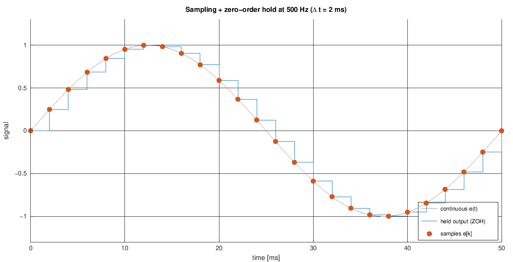
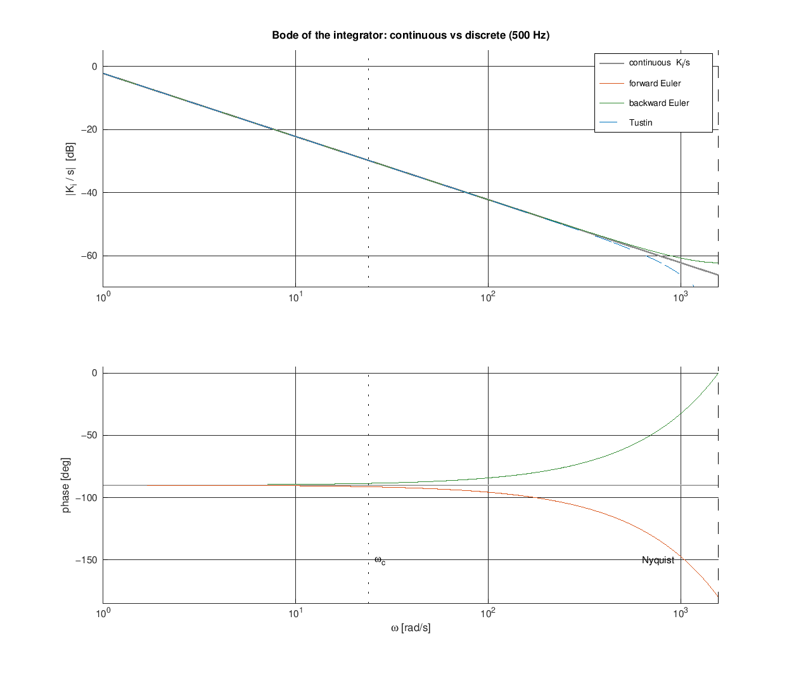
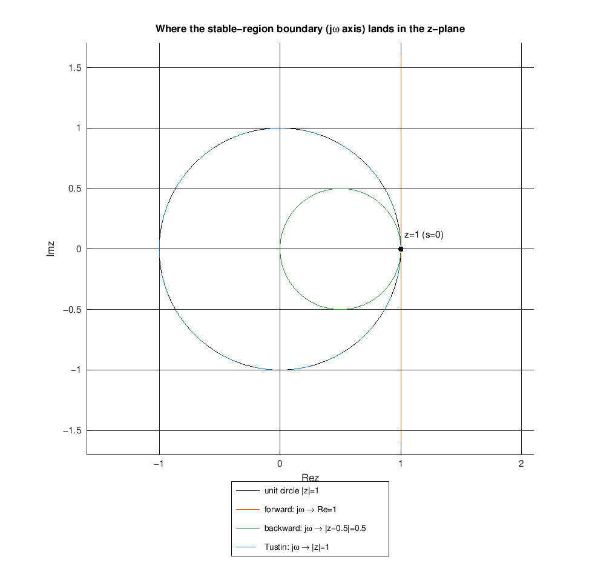
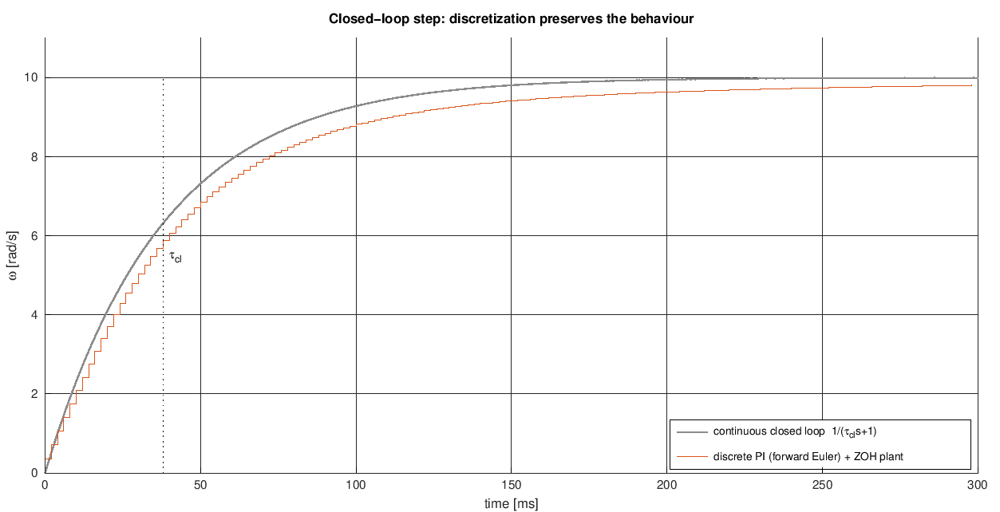

# Discretizing the Wheel PI: from the s-Domain to a Sampled Loop

We *design* the wheel controller in continuous time - $C(s) = K_p + K_i/s$, tuned
by pole-zero cancellation and checked on a Nyquist plot ([pi-tuning.md](pi-tuning.md)).
But a microcontroller cannot evaluate that integral continuously. It wakes on a
fixed clock, reads the sensor, computes **one** number, and holds it until the next
tick. This note explains, at university level, how the continuous PI becomes a
recipe the digital loop can run, what choices that involves, and - with Bode and
z-plane plots - why those choices barely change the design at 500 Hz.

> Math renders in GitHub and Cursor's Markdown preview (KaTeX). Figures are
> generated by
> [../../experiments/pi_discretization/discretization_plots.m](../../experiments/pi_discretization/discretization_plots.m)
> (base Octave). Rates come from [loop-rates.md](loop-rates.md), gains from
> [pi-tuning.md](pi-tuning.md).

## 1. What "digital" changes: sample-and-hold

Two things separate the digital loop from the continuous ideal:

- **Sampling** - the error is only known at the tick instants $t_k = k\,\Delta t$,
  with period $\Delta t = 1/f_s = 2$ ms at $f_s = 500$ Hz.
- **Zero-order hold (ZOH)** - the computed output is applied and **held flat**
  until the next tick, because the actuator (PWM duty) is written once per tick.

So the controller sees a *staircase* view of a smooth world and answers with a
staircase of its own:



Our whole job is to replace the continuous law with a **difference equation** - an
update computed once per tick from these samples - that behaves like $C(s)$.

## 2. Only the integrator needs discretizing

Write the PI as two parallel paths:

$$
u(t) = \underbrace{K_p\,e(t)}_{\text{instantaneous}}
     + \underbrace{K_i\!\int_0^t e(\tau)\,d\tau}_{\text{has memory}}
$$

The proportional path is trivial - $u_P[k] = K_p\,e[k]$, just multiply the latest
sample. All the subtlety is in the integral, the only part with **state** (memory
of the past). "Discretizing the PI" therefore means "discretizing one integral":
approximating a continuous area from samples.

## 3. Three ways to approximate the integral

Each tick the integral grows by the area of $e$ over that step,
$\int_{t_{k-1}}^{t_k} e\,d\tau$. The three textbook rules estimate that thin slice
of area with a rectangle or a trapezoid:

```
   forward (left)        backward (right)        trapezoid (Tustin)
   e|  __                e|      __              e|      __
    | |  |  use e[k-1]    |  ___|  | use e[k]     |     /|  average
    | |  |                | |   |  |              |  __/ |  the two
    +-+--+---> t          +-+---+--+---> t        +-+----+---> t
     k-1  k                k-1   k                 k-1   k
```

Turned into an integrator update $I[k] = I[k-1] + (\dots)$, and equivalently a
substitution for $s$ in $C(s)$:

| Rule | Area used | Integral update | $s \to z$ map | Accuracy |
|------|-----------|-----------------|---------------|----------|
| **Forward** Euler | $\Delta t\,e[k-1]$ | $+\,K_i\,\Delta t\,e[k-1]$ | $s = \dfrac{z-1}{\Delta t}$ | $O(\Delta t)$ |
| **Backward** Euler | $\Delta t\,e[k]$ | $+\,K_i\,\Delta t\,e[k]$ | $s = \dfrac{z-1}{z\,\Delta t}$ | $O(\Delta t)$ |
| **Tustin** (trapezoidal) | $\tfrac{\Delta t}{2}(e[k]+e[k-1])$ | $+\,K_i\,\tfrac{\Delta t}{2}(e[k]+e[k-1])$ | $s = \dfrac{2}{\Delta t}\dfrac{z-1}{z+1}$ | $O(\Delta t^2)$ |

Tustin (trapezoidal) is the most accurate; forward Euler is the cheapest (a plain
running sum). The next two sections show, in the frequency domain, exactly how they
differ - and why at 500 Hz it hardly matters.

## 4. The discrete PI

Taking the simplest rule, **forward Euler**, the controller becomes a two-line
per-tick update (keep a running sum $I$, add it to the proportional term):

$$
\boxed{\,u[k] = K_p\,e[k] + I[k], \qquad I[k{+}1] = I[k] + K_i\,\Delta t\,e[k]\,}
$$

In the $z$-domain (the discrete analogue of the Laplace domain, where a one-tick
delay is $z^{-1}$) this is

$$
C(z) = K_p + \frac{K_i\,\Delta t}{z - 1},
$$

with a pole at $z = 1$ - the unit-circle image of the continuous integrator's pole
at $s = 0$. Same idea as $C(s)$, expressed in samples.

## 5. Comparing the rules in the frequency domain

Substitute $z = e^{j\omega\Delta t}$ to get each discrete integrator's frequency
response, and lay them over the continuous $K_i/s$. This is the plot to internalise:



Read it in two regions:

- **Below ~100 rad/s (well past the loop crossover $\omega_c = 23.8$ rad/s):** all
  four curves sit on top of each other. At the frequencies the control loop
  actually works, every rule *is* the continuous integrator. This is the whole
  reason a crude approximation is allowed.
- **Approaching the Nyquist frequency $\omega_N = \pi/\Delta t \approx 1571$ rad/s:**
  they fan out. The **phase** panel is the cleanest summary:
  - **Tustin** stays exactly on $-90^\circ$ (grey line) - it never distorts phase.
  - **Forward Euler** droops toward $-180^\circ$ - it adds *phase lag*.
  - **Backward Euler** rises toward $0^\circ$ - it adds *phase lead*.

That extra $\pm$ phase is the price of discretizing, and it is concentrated at high
frequency. Forward Euler's added **lag** is the one that eats stability margin - but
notice at $\omega_c$ (dotted line) it is only a few degrees.

## 6. Comparing the rules for stability (the z-plane)

The same three rules also differ in whether they can turn a *stable* design
*unstable*. A continuous system is stable when its poles lie in the left half-plane
($\mathrm{Re}\,s < 0$); a discrete system is stable when its poles lie **inside the
unit circle** ($|z| < 1$). So the question is: where does each rule send the
stability boundary (the imaginary axis $s = j\omega$)?



- **Tustin** maps the imaginary axis exactly onto the unit circle - stable stays
  stable, always. (Its only quirk is *frequency warping*: the axis is stretched to
  fit, hence the phase notch near Nyquist above.)
- **Backward Euler** maps it to a small circle *inside* the unit circle - it even
  pulls some unstable poles in, so it is over-conservative but never dangerous.
- **Forward Euler** maps it to the vertical line $\mathrm{Re}\,z = 1$, which bulges
  *outside* the unit circle on the left. A left-half-plane pole can therefore land
  outside the circle - i.e. a design that is stable in continuous time can become
  unstable when discretized, if the sample rate is too low for its dynamics.

## 7. Why forward Euler is safe here

Forward Euler's two drawbacks - added phase lag and conditional stability - both
vanish when the loop is sampled far faster than its own dynamics, the usual rule
$f_s \gtrsim 20\,f_c$ ([loop-rates.md](loop-rates.md)). For the wheel loop
($\omega_c = 23.8$ rad/s):

- **Heavy oversampling:** $\omega_c\,\Delta t = 23.8 \times 0.002 = 0.048$ rad - the
  loop is ~130x slower than the sample rate, deep in the region where the Bode
  curves above coincide.
- **Tiny per-tick step:** $K_i\,\Delta t \approx 0.77 \times 0.002 = 0.0015$ per
  unit error-second - a slow, smooth sum, nowhere near destabilising.
- **The lag is already budgeted:** forward vs backward Euler differ by exactly
  **one sample** of delay, $\Delta t = 2$ ms. At $\omega_c$ that is
  $\omega_c\,\Delta t = 2.7^\circ$ of phase - and the tuning in
  [pi-tuning.md](pi-tuning.md) already lumps the ZOH + compute latency into a
  transport delay $T_d \approx 1.5\,\Delta t$ and still keeps $60^\circ$ of phase
  margin.

So at 500 Hz the choice of integration rule is a rounding error on the design; the
simple running sum is legitimate. (Had we been forced to sample slowly, we would
switch to Tustin to protect the phase and stability.)

## 8. The measurement filter: a different rule for a different job

The measured wheel speed is noisy (encoder quantization at 500 Hz), so a
first-order low-pass usually precedes the error:

$$
F(s) = \frac{1}{\tau_f\,s + 1}
$$

Here the natural choice is **backward** Euler. Starting from
$\tau_f\,\dot y + y = x$ with $\dot y \approx (y[k]-y[k-1])/\Delta t$:

$$
y[k] = y[k-1] + \alpha\,\big(x[k] - y[k-1]\big),
\qquad
\alpha = \frac{\Delta t}{\tau_f + \Delta t}
$$

- the familiar **exponential smoother**. Why backward here and forward for the
integrator? Because for a *filter* we care most about robustness, and backward
Euler is *unconditionally stable*: its $\alpha$ lies in $(0,1)$ for **any** sample
rate, so the smoother can never ring or overshoot. (Forward Euler on the same
filter gives $\alpha = \Delta t/\tau_f$, which exceeds 1 and rings if the tick is
slow.) The principle: **use the unconditionally stable rule where robustness
matters, the simple rule where it is cheap and safe.**

## 9. Anti-windup is naturally discrete

When the actuator saturates, the integrator keeps summing an error it cannot act
on, then overshoots while it unwinds. On a sampled loop the fix is a per-tick
decision - **conditional integration**: each tick, if the output is already pinned
at its limit *in the same direction as the error*, skip that tick's integral update
(freeze the running sum, do not reset it); otherwise integrate as normal, with a
hard clamp on the state as a backstop. It composes cleanly with §4 precisely
because the integral is already advanced one tick at a time.

## 10. Closing the loop in discrete time

To simulate or check stability you also need the **plant** sampled. Unlike the
controller, the first-order motor $G(s) = K/(\tau s + 1)$ has an **exact** discrete
equivalent under a ZOH (no approximation, because the input really is held flat):

$$
\omega[k{+}1] = a_d\,\omega[k] + b_d\,u[k], \qquad
a_d = e^{-\Delta t/\tau}, \quad b_d = K\,(1 - a_d)
$$

Pairing the exact-ZOH plant with the forward-Euler controller and running a step
gives the payoff - the discrete loop reproduces the continuous first-order design
($\tau_{cl} = \tau/5$), lagging only by the sampling it cannot avoid:



Discretization changed the *implementation*, not the *behaviour* - exactly the goal.

## Reproduce

All four figures (and the step check) come from one base-Octave script:

```bash
cd experiments/pi_discretization
octave --eval discretization_plots        # writes the four PNGs into docs/theory/
```

The core loop - discrete PI (forward-Euler integral, conditional anti-windup) +
backward-Euler measurement filter + exact-ZOH plant - is just:

```octave
K = 34; tau = 0.19; dt = 1/500;          % nominal motor (illustration)
Kp = tau/(K*tau/5); Ki = 1/(K*tau/5);    % nominal IMC gains, tau_cl = tau/5 (pi-tuning.md).
                                         % Firmware uses per-wheel defaults (wheel_pi.c):
                                         % L 0.1455/0.6737, R 0.1554/0.8265.
ad = exp(-dt/tau); bd = K*(1-ad);        % exact ZOH plant
tau_f = 0.02; a = dt/(tau_f+dt);         % backward-Euler measurement LPF
w = 0; wf = 0; I = 0; wsp = 10; N = 200; W = zeros(1,N);
for k = 1:N
  wf = wf + a*(w - wf);                   % filter the measurement
  e  = wsp - wf;
  u  = Kp*e + I;                          % P + stored integral
  us = max(-1, min(1, u));
  if u == us, I = I + Ki*e*dt; end        % forward-Euler integral w/ anti-windup
  w  = ad*w + bd*us;  W(k) = w;           % plant advances one tick
end
plot((1:N)*dt, W); grid on; xlabel('t [s]'); ylabel('\omega [rad/s]');
```
