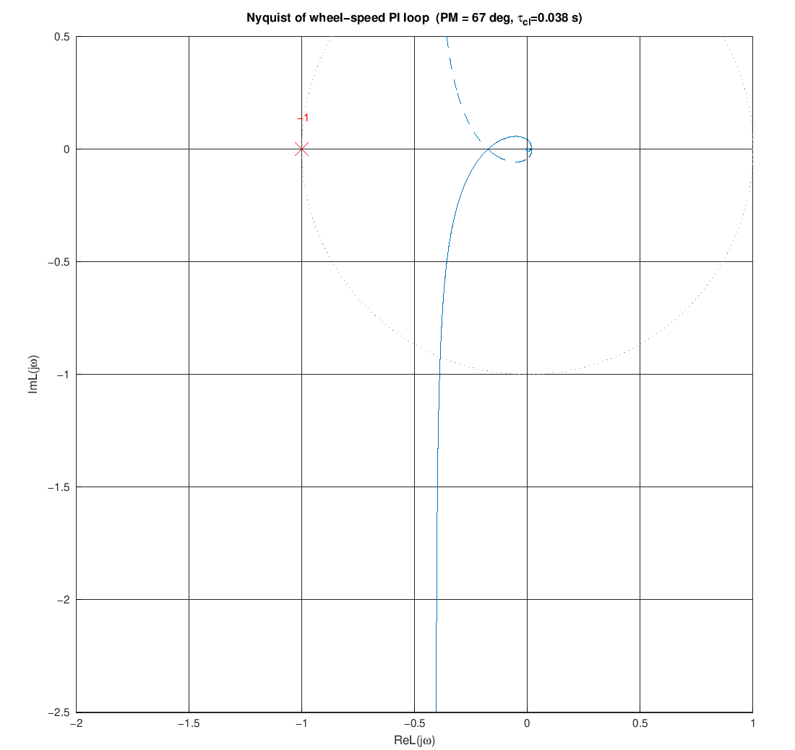
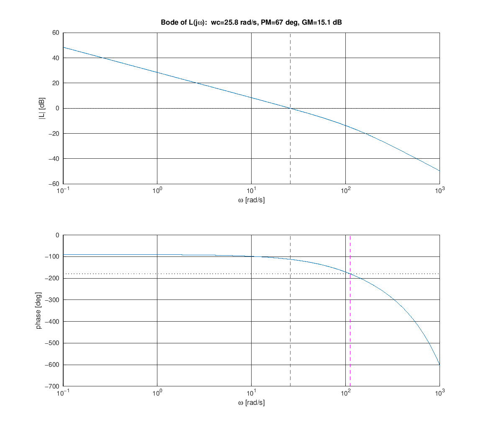

# PI Tuning for a First-Order Motor

How to choose the $K_p$, $K_i$ of the [wheel-speed-controller](wheel-speed-controller.md)
from the identified motor model, and how to check the result in the frequency
domain (Nyquist and Bode). This is the analytic counterpart to the "raise $K_p$,
then add $K_i$" heuristic in that doc.

> Math below renders in GitHub and in Cursor's Markdown preview (KaTeX). If your
> viewer does not render `$...$`, use the Markdown preview.

> Uses only base Octave - no `control` package. The reproducible script (Nyquist
> + Bode + margins) is
> [../../experiments/motor_tuning/pi_tuning_analysis.m](../../experiments/motor_tuning/pi_tuning_analysis.m);
> see [../../experiments/motor_tuning/](../../experiments/motor_tuning/) for the
> hands-on procedure.

## The plant

From [motor-identification.md](motor-identification.md), each free-spinning wheel
is first order from duty $u$ to angular speed $\omega$:

$$
G(s) = \frac{K}{\tau s + 1}
$$

Identified on hardware (average of both wheels, $R^2 \approx 0.97$):

$$
K \approx 34\ \text{rad/s per unit duty}, \qquad \tau \approx 0.19\ \text{s}
$$

## The controller

A PI controller, written two equivalent ways:

$$
C(s) = K_p + \frac{K_i}{s} = K_p\,\frac{T_i s + 1}{T_i s}, \qquad T_i = \frac{K_p}{K_i}
$$

$T_i$ (the integral time) is the location of the PI **zero** at $s = -1/T_i$.

## Tuning by pole-zero cancellation (IMC)

The plant has a single pole at $s = -1/\tau$. Put the PI zero right on top of it -
choose $T_i = \tau$ - and the open loop collapses to a pure integrator (the plant
pole and PI zero cancel):

$$
L(s) = C(s)\,G(s) = K_p\,\frac{\tau s + 1}{\tau s}\cdot\frac{K}{\tau s + 1}
     = \frac{K_p K}{\tau s}
$$

### Closing the loop: where $L/(1+L)$ comes from

$L(s)$ above is the **open loop** - controller times plant, the signal traced once
from error to output without yet feeding it back. The wheel loop uses **unity
negative feedback**: it forms the error $e = \omega_{set} - \omega$, runs it
through $L$, and subtracts the output back at the summing junction.

```text
        e            u              ω
ω_set ──►(+)──►[ C(s) ]──►[ G(s) ]──┬──► ω
          ▲-                        │
          │                         │
          └─────────────────────────┘
              (feedback: subtract ω)
```

The diagram states exactly two equations:

$$
\omega = L(s)\,e \qquad\text{and}\qquad e = \omega_{set} - \omega
$$

Substitute the second into the first and solve for the output:

$$
\omega = L\,(\omega_{set} - \omega)
\;\Longrightarrow\;
\omega + L\,\omega = L\,\omega_{set}
\;\Longrightarrow\;
\omega\,(1 + L) = L\,\omega_{set}
$$

$$
T(s) = \frac{\omega}{\omega_{set}} = \frac{L}{1 + L}
$$

The **numerator** is the forward path; the **denominator** is $1$ plus the loop
gain. (With a non-unity feedback $H(s)$ it would be $L/(1 + LH)$; here $H = 1$.)
The closed-loop poles are the roots of $1 + L = 0$, i.e. where $L(j\omega) = -1$ -
the same `-1` point the Nyquist plot below watches.

### The closed loop is then exactly first order

Substitute $L = \dfrac{K_p K}{\tau s}$ and clear the fraction (multiply top and
bottom by $\tau s$):

$$
T(s) = \frac{L}{1 + L}
     = \frac{\dfrac{K_p K}{\tau s}}{1 + \dfrac{K_p K}{\tau s}}
     = \frac{K_p K}{\tau s + K_p K}
     = \frac{1}{\dfrac{\tau}{K_p K}\, s + 1}
     = \frac{1}{\tau_{cl}\, s + 1},
\qquad
\tau_{cl} = \frac{\tau}{K_p K}
$$

The denominator is degree one in $s$ (a single pole at $s = -1/\tau_{cl}$), so the
closed loop is exactly **first order** - same shape as the plant, but with DC gain
forced to $1$ (zero steady-state error) and a time constant $\tau_{cl}$ you choose
instead of the $\tau$ the hardware forced on you.

Here **$\tau_{cl}$** (tau, subscript "cl" = *closed loop*) is the **closed-loop
time constant**: how fast the controlled wheel reaches its setpoint - it settles
to ~63% of a step in one $\tau_{cl}$, and ~fully in $4\tau_{cl}$. Do not confuse
it with $\tau$: $\tau$ is the *open-loop* plant time constant you **measure**
(~0.19 s), while $\tau_{cl}$ is the *closed-loop* one you **choose**.

Solving for the gains gives the whole tuning in two lines:

$$
\boxed{\ K_p = \frac{\tau}{K\,\tau_{cl}}, \qquad
        K_i = \frac{K_p}{\tau} = \frac{1}{K\,\tau_{cl}}\ }
$$

One physical knob, $\tau_{cl}$: how fast the closed wheel loop should respond.

### Choosing $\tau_{cl}$

- Faster than open loop: $\tau_{cl} = \tau/3$ (gentle) down to $\tau/10$ (aggressive).
- Rule-of-thumb bandwidth: $\omega_c \approx 1/\tau_{cl}$ [rad/s].
- Faster costs **duty**: a step of $\Delta\omega$ demands an initial $K_p\,\Delta\omega$
  of duty. If that saturates past $\pm 1$, the response is no longer first order -
  back off $\tau_{cl}$ or expect the anti-windup to take over.
- The inner loop should be several times faster than the future balance loop so
  the cascade does not fight itself (see [README.md](README.md)).

Worked example, $\tau_{cl} = \tau/5 = 0.038\ \text{s}$:

$$
K_p = \frac{0.19}{34 \cdot 0.038} = 0.147, \qquad
K_i = \frac{1}{34 \cdot 0.038} = 0.774
$$

## Frequency-domain check: Nyquist

The Nyquist plot of the open loop $L(j\omega)$ tells us how far the design is from
instability. With **ideal** cancellation $L = 1/(\tau_{cl}\, s)$ is a pure
integrator: its Nyquist is the negative imaginary axis - it never encircles $-1$,
giving $90^\circ$ phase margin and infinite gain margin. Perfectly stable, but
that ignores reality.

The real discrete loop adds two lags the cancellation cannot remove:

- a **sample-and-hold + compute delay** $e^{-s T_d}$, with $T_d \approx 1.5\,\Delta t = 7.5\ \text{ms}$
  at 200 Hz, and
- a light **measurement low-pass** on the (quantized) encoder-rate signal,
  $\dfrac{1}{\tau_f s + 1}$, with $\tau_f \approx 8\ \text{ms}$.

**Why cancellation can't remove them.** The IMC trick kills a *pole* by parking a
*zero* on it - pure algebra on rational transfer functions. The delay $e^{-sT_d}$
is not rational (no finite pole to cancel; you'd need a predictor), and the
measurement pole $\tau_f$ lives in the sensing path and is deliberately left in
place - a zero there would re-amplify the encoder quantization noise the filter
exists to suppress. Both pass ~unit magnitude at low frequency but add **negative
phase** that grows with frequency, which is what erodes phase margin:

- delay: $\angle = -\omega T_d$ (linear, unbounded) $\to -11^\circ$ at $\omega_c$;
- filter: $\angle = -\arctan(\omega\tau_f)$ (saturates at $-90^\circ$) $\to -12^\circ$ at $\omega_c$.

So the phase budget at crossover is
$-90^\circ_{\,\text{(integrator)}} - 11^\circ_{\,\text{(delay)}} - 12^\circ_{\,\text{(filter)}} \approx -113^\circ$,
i.e. $\mathrm{PM} \approx 67^\circ$ - the finite margin below in place of the ideal
integrator's $90^\circ$.

So the loop actually analyzed is:

$$
L(s) = \left(K_p + \frac{K_i}{s}\right)\frac{K}{\tau s + 1}\;e^{-s T_d}\;\frac{1}{\tau_f s + 1}
$$



For the worked gains this gives healthy margins:

| Quantity | Value | Target |
|----------|-------|--------|
| Gain crossover $\omega_c$ | 25.8 rad/s | - |
| Phase margin $\mathrm{PM}$ | $67^\circ$ | $> 45$-$60^\circ$ |
| Gain margin $\mathrm{GM}$ | 15 dB | $> 6$ dB |

The locus passes well to the right of the `-1` point and does not encircle it, so
the closed loop is stable with comfortable robustness to gain error (the +/-13%
battery-voltage swing in `K` from [motor-identification.md](motor-identification.md)
is easily inside a 15 dB gain margin).

### Same information as a Bode plot

The Bode plot reads the two margins off directly, which is often easier than the
Nyquist for tuning:



- **Magnitude** falls at $-20$ dB/decade (the integrator) and crosses 0 dB at the
  gain crossover $\omega_c = 25.8$ rad/s (red dashed). The extra roll-off past
  ~100 rad/s is the measurement low-pass.
- **Phase** starts at $-90^\circ$ (integrator), and at $\omega_c$ it sits at
  $-113^\circ$ - the gap to $-180^\circ$ is the **phase margin, $67^\circ$**.
- Where the phase reaches $-180^\circ$ ($\omega_p = 112$ rad/s, magenta) the
  magnitude is 15 dB below 0 dB - that gap is the **gain margin, 15 dB**.

Nyquist and Bode are the same $L(j\omega)$, just plotted differently: the Nyquist
shows distance from $-1$, the Bode shows the margins as vertical gaps.

**The delay sets the floor on $\tau_{cl}$.** Shrinking $\tau_{cl}$ pushes
$\omega_c$ higher, where the delay's phase lag $-\omega_c T_d$ grows; roughly

$$
\mathrm{PM} \approx 90^\circ - \omega_c T_d\cdot\frac{180}{\pi}
                             - \arctan(\omega_c \tau_f)\cdot\frac{180}{\pi},
\qquad \omega_c \approx \frac{1}{\tau_{cl}}
$$

Halving $\tau_{cl}$ roughly doubles $\omega_c$ and eats into PM - re-run the
script and watch the margins rather than pushing gains blindly.

## Reproduce / retune in Octave

[../../experiments/motor_tuning/pi_tuning_analysis.m](../../experiments/motor_tuning/pi_tuning_analysis.m)
takes your motor's `K` and `tau` (and optionally `tau_cl`) as arguments, falling
back to the identified defaults ($K = 34$, $\tau = 0.19$, $\tau_{cl} = \tau/5$)
when called with none:

```bash
cd experiments/motor_tuning
octave --eval "pi_tuning_analysis"                 # identified defaults
octave --eval "pi_tuning_analysis(34, 0.19)"       # your K, tau
octave --eval "pi_tuning_analysis(50, 0.12, 0.03)" # also pick tau_cl [s]
```

Each run prints `Kp`, `Ki`, `PM`, `GM` and saves the Nyquist + Bode PNGs (default
parameters keep the base names used above; custom ones get an auto suffix).

A quick closed-loop step check (no control package), same idea as the snippet in
the wheel-speed bring-up:

```octave
K = 34; tau = 0.19; tau_cl = tau/5;
Kp = tau/(K*tau_cl);  Ki = 1/(K*tau_cl);
dt = 1/200; ad = exp(-dt/tau); bd = K*(1-ad);   % exact ZOH plant
w = 0; I = 0; wsp = 10; N = 200; W = zeros(1,N);
for k = 1:N
  e = wsp - w;
  u = Kp*e + I + Ki*dt*e;
  us = max(-1, min(1, u));
  if u == us, I = I + Ki*dt*e; end              % conditional-integration anti-windup
  w = ad*w + bd*us;  W(k) = w;
end
plot((1:N)*dt, W); grid on; xlabel('t [s]'); ylabel('\omega [rad/s]');
```

## From here to firmware

These $K_p$, $K_i$ drop straight into the
[wheel-speed-controller](wheel-speed-controller.md) control law, on top of its
feedforward ($u_{ff} = \omega_{set}/K$), deadband compensation, and anti-windup.
Because the feedforward already supplies most of the duty, the PI only trims the
residual, so the cancellation-based gains are a conservative, robust starting
point - then fine-tune on hardware against a real step.
